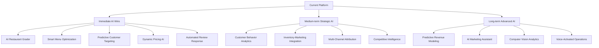

# 🤖 Comprehensive AI Integration Strategy for Restaurant Marketing Platform

## Executive Summary

This document outlines a comprehensive AI integration strategy for the restaurant marketing platform, focusing on **real revenue generation** while balancing operational efficiency and customer growth. The strategy is organized into three phases with specific revenue projections and implementation timelines.

## Current System Analysis

Based on analysis of the existing platform, the current system includes:
- **Marketing Foundations Component**: Checklist system with progress tracking and revenue impact calculations
- **Campaign Management**: Facebook Ads and SMS campaigns with OpenAI-generated content
- **Dashboard Analytics**: Performance metrics, momentum scoring, and revenue potential tracking
- **Content Generation**: AI-powered ad copy, SMS messages, social media posts, and email campaigns
- **Restaurant Authentication**: Multi-tenant system with admin impersonation capabilities

## 🎯 AI Integration Strategy Overview



---

## 🚀 Phase 1: Immediate High-Impact AI Integrations (0-3 months)

### 1. AI Restaurant Digital Presence Grader (NEW FLAGSHIP FEATURE)
**Revenue Impact**: $1,000-2,500/month per restaurant
**Use Case**: Comprehensive AI analysis of restaurant's entire digital footprint with actionable recommendations
**Business Value**: Lead generation tool + onboarding assessment + ongoing optimization tracker

#### Technical Implementation:
```python
class RestaurantDigitalGrader:
    def __init__(self):
        self.google_analyzer = GoogleBusinessProfileAnalyzer()
        self.yelp_analyzer = YelpProfileAnalyzer()
        self.social_analyzer = SocialMediaAnalyzer()
        self.website_analyzer = WebsiteAnalyzer()
        self.delivery_analyzer = DeliveryPlatformAnalyzer()
        
    async def generate_comprehensive_grade(self, restaurant_inputs):
        """
        Analyzes all digital touchpoints and generates overall grade
        """
        scores = {}
        recommendations = {}
        
        # Google Business Profile Analysis
        if restaurant_inputs.get('google_business_url'):
            gbp_data = await self.google_analyzer.analyze_profile(
                restaurant_inputs['google_business_url']
            )
            scores['google_business'] = gbp_data['score']
            recommendations['google_business'] = gbp_data['recommendations']
        
        # Yelp Analysis
        if restaurant_inputs.get('yelp_url'):
            yelp_data = await self.yelp_analyzer.analyze_profile(
                restaurant_inputs['yelp_url']
            )
            scores['yelp'] = yelp_data['score']
            recommendations['yelp'] = yelp_data['recommendations']
        
        # Social Media Analysis
        if restaurant_inputs.get('social_handles'):
            social_data = await self.social_analyzer.analyze_presence(
                restaurant_inputs['social_handles']
            )
            scores['social_media'] = social_data['score']
            recommendations['social_media'] = social_data['recommendations']
        
        # Website Analysis
        if restaurant_inputs.get('website_url'):
            website_data = await self.website_analyzer.analyze_site(
                restaurant_inputs['website_url']
            )
            scores['website'] = website_data['score']
            recommendations['website'] = website_data['recommendations']
        
        # Delivery Platform Analysis
        if restaurant_inputs.get('delivery_urls'):
            delivery_data = await self.delivery_analyzer.analyze_platforms(
                restaurant_inputs['delivery_urls']
            )
            scores['delivery_platforms'] = delivery_data['score']
            recommendations['delivery_platforms'] = delivery_data['recommendations']
        
        # Calculate Overall Grade
        overall_grade = self.calculate_weighted_grade(scores)
        priority_recommendations = self.prioritize_recommendations(
            recommendations, scores
        )
        
        return {
            'overall_grade': overall_grade,
            'category_scores': scores,
            'priority_recommendations': priority_recommendations,
            'estimated_revenue_impact': self.calculate_revenue_potential(scores),
            'generated_at': datetime.now().isoformat()
        }
    
    def calculate_weighted_grade(self, scores):
        """Calculate weighted overall grade based on importance"""
        weights = {
            'google_business': 0.30,  # Most important for local discovery
            'website': 0.25,          # Critical for conversions
            'delivery_platforms': 0.20, # Major revenue source
            'social_media': 0.15,     # Brand awareness
            'yelp': 0.10             # Additional reviews
        }
        
        weighted_score = 0
        total_weight = 0
        
        for category, score in scores.items():
            if category in weights:
                weighted_score += score * weights[category]
                total_weight += weights[category]
        
        return round(weighted_score / total_weight if total_weight > 0 else 0)

class GoogleBusinessProfileAnalyzer:
    async def analyze_profile(self, gbp_url):
        """Analyze Google Business Profile completeness and optimization"""
        analysis = {
            'score': 0,
            'recommendations': [],
            'metrics': {}
        }
        
        # Use Google My Business API or web scraping
        profile_data = await self.fetch_gbp_data(gbp_url)
        
        # Scoring criteria
        score_factors = {
            'profile_completeness': 25,  # All fields filled
            'photo_quality': 20,         # High-quality photos
            'review_management': 20,     # Response rate to reviews
            'post_frequency': 15,        # Regular posts
            'menu_accuracy': 10,         # Updated menu
            'hours_accuracy': 10         # Correct hours
        }
        
        # Calculate scores for each factor
        for factor, max_points in score_factors.items():
            factor_score = self.evaluate_factor(profile_data, factor)
            analysis['score'] += factor_score * (max_points / 100)
            
            if factor_score < 80:  # If below 80%, add recommendation
                analysis['recommendations'].append(
                    self.get_recommendation(factor, factor_score)
                )
        
        return analysis

class YelpProfileAnalyzer:
    async def analyze_profile(self, yelp_url):
        """Analyze Yelp profile optimization"""
        # Similar structure to Google Business Profile
        # Focus on: photos, menu, hours, review responses, special features
        pass

class SocialMediaAnalyzer:
    async def analyze_presence(self, social_handles):
        """Analyze social media presence across platforms"""
        platforms = ['instagram', 'facebook', 'tiktok', 'twitter']
        analysis = {
            'score': 0,
            'recommendations': [],
            'platform_scores': {}
        }
        
        for platform in platforms:
            if platform in social_handles:
                platform_analysis = await self.analyze_platform(
                    platform, social_handles[platform]
                )
                analysis['platform_scores'][platform] = platform_analysis
        
        # Calculate overall social media score
        analysis['score'] = self.calculate_social_score(analysis['platform_scores'])
        analysis['recommendations'] = self.generate_social_recommendations(
            analysis['platform_scores']
        )
        
        return analysis

class WebsiteAnalyzer:
    async def analyze_site(self, website_url):
        """Analyze website optimization for restaurants"""
        analysis = {
            'score': 0,
            'recommendations': [],
            'metrics': {}
        }
        
        # Use web scraping + SEO analysis tools
        site_data = await self.fetch_website_data(website_url)
        
        score_factors = {
            'mobile_responsiveness': 25,
            'page_load_speed': 20,
            'menu_accessibility': 20,
            'contact_info_clarity': 15,
            'online_ordering': 10,
            'seo_optimization': 10
        }
        
        for factor, max_points in score_factors.items():
            factor_score = self.evaluate_website_factor(site_data, factor)
            analysis['score'] += factor_score * (max_points / 100)
            
            if factor_score < 80:
                analysis['recommendations'].append(
                    self.get_website_recommendation(factor, factor_score)
                )
        
        return analysis

class DeliveryPlatformAnalyzer:
    async def analyze_platforms(self, delivery_urls):
        """Analyze delivery platform optimization"""
        platforms = ['doordash', 'ubereats', 'grubhub', 'postmates']
        analysis = {
            'score': 0,
            'recommendations': [],
            'platform_scores': {}
        }
        
        for platform_url in delivery_urls:
            platform_name = self.identify_platform(platform_url)
            if platform_name in platforms:
                platform_analysis = await self.analyze_delivery_platform(
                    platform_name, platform_url
                )
                analysis['platform_scores'][platform_name] = platform_analysis
        
        analysis['score'] = self.calculate_delivery_score(analysis['platform_scores'])
        analysis['recommendations'] = self.generate_delivery_recommendations(
            analysis['platform_scores']
        )
        
        return analysis
```

#### Integration with Existing System:
```javascript
// Add to MarketingFoundations.js
const AIGraderSection = () => {
  const [graderResults, setGraderResults] = useState(null);
  const [isAnalyzing, setIsAnalyzing] = useState(false);
  
  const runDigitalGrader = async (restaurantInputs) => {
    setIsAnalyzing(true);
    try {
      const results = await api.post('/ai/digital-grader', restaurantInputs);
      setGraderResults(results.data);
    } catch (error) {
      console.error('Grader analysis failed:', error);
    } finally {
      setIsAnalyzing(false);
    }
  };
  
  return (
    <div className="ai-grader-section">
      <h2>🎯 AI Digital Presence Grader</h2>
      <div className="grader-input-form">
        <RestaurantInputForm onSubmit={runDigitalGrader} />
      </div>
      
      {graderResults && (
        <div className="grader-results">
          <div className="overall-grade">
            <div className="grade-circle">
              <span className="grade-number">{graderResults.overall_grade}</span>
              <span className="grade-label">DIGITAL SCORE</span>
            </div>
          </div>
          
          <div className="category-breakdown">
            {Object.entries(graderResults.category_scores).map(([category, score]) => (
              <div key={category} className="category-score">
                <span className="category-name">{category}</span>
                <div className="score-bar">
                  <div 
                    className="score-fill" 
                    style={{ width: `${score}%` }}
                  ></div>
                </div>
                <span className="score-number">{score}</span>
              </div>
            ))}
          </div>
          
          <div className="priority-recommendations">
            <h3>🚀 Priority Actions</h3>
            {graderResults.priority_recommendations.map((rec, index) => (
              <div key={index} className="recommendation-card">
                <div className="rec-impact">
                  <span className="impact-badge">${rec.revenue_impact}/month</span>
                </div>
                <div className="rec-content">
                  <h4>{rec.title}</h4>
                  <p>{rec.description}</p>
                  <div className="rec-actions">
                    <button className="implement-btn">Implement Now</button>
                    <button className="learn-more-btn">Learn More</button>
                  </div>
                </div>
              </div>
            ))}
          </div>
        </div>
      )}
    </div>
  );
};
```

**Integration Complexity**: High (requires multiple API integrations)
**Required Data/APIs**: 
- Google My Business API
- Yelp Fusion API
- Social media APIs (Instagram, Facebook, TikTok)
- Website analysis tools (PageSpeed Insights, SEO APIs)
- Web scraping for delivery platforms
**Expected ROI**: 25-40% improvement in digital presence effectiveness

### 2. Smart Menu Optimization Engine
**Revenue Impact**: $2,000-5,000/month per restaurant
**Use Case**: AI analyzes sales data, weather, events, and trends to recommend menu changes and pricing
**Implementation**: 
- Integrate with POS systems (Toast, Square, Clover)
- Use ML models to predict item performance
- Generate automated menu recommendations

```python
class MenuOptimizationAI:
    def __init__(self):
        self.pos_integrator = POSIntegrator()
        self.weather_service = WeatherService()
        self.events_service = LocalEventsService()
        
    async def analyze_menu_performance(self, restaurant_id):
        """Comprehensive menu analysis with actionable recommendations"""
        
        # Get sales data from POS
        sales_data = await self.pos_integrator.get_sales_data(restaurant_id)
        
        # Get contextual data
        weather_data = await self.weather_service.get_forecast(restaurant_id)
        events_data = await self.events_service.get_local_events(restaurant_id)
        
        # ML Analysis
        analysis = {
            'underperforming_items': self.identify_underperformers(sales_data),
            'high_margin_opportunities': self.find_margin_opportunities(sales_data),
            'seasonal_recommendations': self.generate_seasonal_recs(weather_data),
            'event_based_promotions': self.suggest_event_promotions(events_data),
            'pricing_optimizations': self.optimize_pricing(sales_data)
        }
        
        return analysis
    
    def generate_pricing_recommendations(self, market_data):
        """Dynamic pricing based on demand, competition, costs"""
        recommendations = []
        
        for item in market_data['menu_items']:
            # Analyze demand patterns
            demand_score = self.calculate_demand_score(item)
            
            # Check competitor pricing
            competitor_prices = self.get_competitor_pricing(item)
            
            # Calculate optimal price
            optimal_price = self.calculate_optimal_price(
                item, demand_score, competitor_prices
            )
            
            if abs(optimal_price - item['current_price']) > 0.50:
                recommendations.append({
                    'item_name': item['name'],
                    'current_price': item['current_price'],
                    'recommended_price': optimal_price,
                    'expected_impact': self.calculate_price_impact(item, optimal_price),
                    'confidence': self.calculate_confidence(item)
                })
        
        return recommendations
```

**Integration Complexity**: Medium (requires POS integration)
**Required Data/APIs**: POS sales data, weather API, local events API, competitor pricing
**Expected ROI**: 15-25% increase in profit margins

### 3. Predictive Customer Targeting & Winback AI
**Revenue Impact**: $1,500-3,000/month per restaurant
**Use Case**: AI predicts which customers are likely to churn and creates personalized winback campaigns
**Implementation**: Enhance existing SMS/email campaigns with predictive targeting

```python
class PredictiveTargetingAI:
    def __init__(self):
        self.ml_model = CustomerChurnPredictor()
        self.personalization_engine = PersonalizationEngine()
    
    async def identify_at_risk_customers(self, restaurant_id):
        """ML model to predict churn probability"""
        customer_data = await self.get_customer_data(restaurant_id)
        
        predictions = []
        for customer in customer_data:
            churn_probability = self.ml_model.predict_churn(customer)
            clv_score = self.calculate_clv(customer)
            
            if churn_probability > 0.7 and clv_score > 100:  # High-value at-risk customers
                predictions.append({
                    'customer_id': customer['id'],
                    'churn_probability': churn_probability,
                    'clv_score': clv_score,
                    'recommended_action': self.get_recommended_action(customer),
                    'personalized_offer': self.generate_personalized_offer(customer)
                })
        
        return sorted(predictions, key=lambda x: x['clv_score'], reverse=True)
    
    def generate_personalized_offers(self, customer_profile):
        """Create targeted offers based on past behavior"""
        offer_types = {
            'discount_favorite': f"20% off your favorite {customer_profile['favorite_item']}",
            'free_appetizer': "Free appetizer with your next order",
            'loyalty_bonus': "Double points on your next 3 visits",
            'birthday_special': "Special birthday celebration meal",
            'bring_friend': "Buy one entree, get one 50% off"
        }
        
        # Use ML to select best offer type for this customer
        best_offer = self.personalization_engine.select_best_offer(
            customer_profile, offer_types
        )
        
        return best_offer
```

**Integration Complexity**: Low (builds on existing campaign system)
**Required Data/APIs**: Customer transaction history, visit frequency, order patterns
**Expected ROI**: 20-30% improvement in customer retention

### 4. Dynamic Social Media Content Generator
**Revenue Impact**: $800-1,500/month per restaurant
**Use Case**: AI creates daily social media content based on menu items, weather, local events, and trending topics
**Implementation**: Enhance existing openai_service.py with contextual content generation

```python
# Enhancement to existing OpenAI service
class ContextualContentAI:
    def __init__(self):
        self.openai_service = openai_service
        self.context_aggregator = ContextAggregator()
    
    async def generate_contextual_social_content(self, restaurant_data, context_data):
        """Generate social media content based on real-time context"""
        
        # Aggregate context
        context = await self.context_aggregator.get_context(restaurant_data)
        
        # Weather-based content
        if context['weather']['condition'] == 'cold':
            content_prompt = f"Create Instagram post for {restaurant_data['name']} promoting warm comfort food on this cold day. Weather: {context['weather']['temp']}°F"
        
        # Event-driven content
        elif context['local_events']:
            event = context['local_events'][0]
            content_prompt = f"Create social media post for {restaurant_data['name']} related to {event['name']} happening nearby"
        
        # Trending hashtag integration
        elif context['trending_hashtags']:
            hashtags = context['trending_hashtags'][:3]
            content_prompt = f"Create engaging post for {restaurant_data['name']} incorporating trending hashtags: {', '.join(hashtags)}"
        
        # Generate content using OpenAI
        result = await self.openai_service.generate_social_media_post(
            restaurant_name=restaurant_data['name'],
            platform="instagram",
            content_type="contextual",
            item_to_promote=context.get('featured_item', ''),
            offer=context.get('current_promotion', '')
        )
        
        # Add context-specific enhancements
        enhanced_content = self.enhance_with_context(result['social_post'], context)
        
        return {
            'content': enhanced_content,
            'context_used': context,
            'optimal_post_time': self.calculate_optimal_post_time(restaurant_data),
            'expected_engagement': self.predict_engagement(enhanced_content, context)
        }
```

**Integration Complexity**: Low (extends existing content generation)
**Required Data/APIs**: Weather API, local events API, social media trending topics
**Expected ROI**: 40-60% increase in social media engagement

### 5. Automated Review Response System
**Revenue Impact**: $500-1,200/month per restaurant
**Use Case**: AI monitors and responds to online reviews across all platforms with brand-consistent responses
**Implementation**: New service integrated with review monitoring APIs

```python
class ReviewResponseAI:
    def __init__(self):
        self.sentiment_analyzer = SentimentAnalyzer()
        self.response_generator = ResponseGenerator()
        self.brand_voice_analyzer = BrandVoiceAnalyzer()
    
    async def monitor_reviews(self, restaurant_id):
        """Monitor Google, Yelp, Facebook reviews"""
        platforms = ['google', 'yelp', 'facebook', 'tripadvisor']
        new_reviews = []
        
        for platform in platforms:
            platform_reviews = await self.get_platform_reviews(restaurant_id, platform)
            new_reviews.extend(platform_reviews)
        
        # Process each new review
        for review in new_reviews:
            await self.process_review(restaurant_id, review)
        
        return new_reviews
    
    async def generate_response(self, review_data, restaurant_brand_voice):
        """Generate appropriate responses based on sentiment"""
        
        # Analyze sentiment and key topics
        sentiment = self.sentiment_analyzer.analyze(review_data['text'])
        key_topics = self.extract_key_topics(review_data['text'])
        
        # Determine response strategy
        if sentiment['score'] >= 0.6:  # Positive review
            response_type = 'positive_appreciation'
        elif sentiment['score'] <= -0.6:  # Negative review
            response_type = 'negative_resolution'
        else:  # Neutral review
            response_type = 'neutral_engagement'
        
        # Generate personalized response
        response = await self.response_generator.generate(
            review_text=review_data['text'],
            response_type=response_type,
            brand_voice=restaurant_brand_voice,
            key_topics=key_topics,
            customer_name=review_data.get('customer_name', '')
        )
        
        return {
            'response_text': response,
            'sentiment_analysis': sentiment,
            'response_type': response_type,
            'confidence_score': self.calculate_confidence(response, review_data)
        }
```

**Integration Complexity**: Medium (requires multiple review platform APIs)
**Required Data/APIs**: Google My Business API, Yelp API, Facebook API
**Expected ROI**: 15-25% improvement in online reputation scores

---

## 📈 Phase 2: Medium-term Strategic AI Integrations (3-9 months)

### 1. Customer Lifetime Value (CLV) Predictor
**Revenue Impact**: $3,000-6,000/month per restaurant
**Use Case**: AI predicts customer lifetime value and recommends personalized marketing spend allocation
**Implementation**: Advanced analytics dashboard with CLV scoring

### 2. Inventory-Driven Marketing Automation
**Revenue Impact**: $2,500-4,500/month per restaurant
**Use Case**: AI creates marketing campaigns based on inventory levels, expiration dates, and waste reduction
**Implementation**: Integration with inventory management systems

### 3. Multi-Channel Attribution Engine
**Revenue Impact**: $1,800-3,200/month per restaurant
**Use Case**: AI tracks customer journey across all touchpoints and optimizes marketing spend allocation
**Implementation**: Advanced analytics with cross-platform tracking

### 4. Competitive Intelligence Dashboard
**Revenue Impact**: $1,200-2,500/month per restaurant
**Use Case**: AI monitors competitor pricing, promotions, and social media to recommend strategic responses
**Implementation**: Web scraping and analysis engine

### 5. Voice-Activated Order Optimization
**Revenue Impact**: $2,000-4,000/month per restaurant
**Use Case**: AI analyzes phone orders and suggests upsells in real-time to staff
**Implementation**: Voice recognition and NLP processing

---

## 🔮 Phase 3: Long-term Advanced AI Features (9-18 months)

### 1. Predictive Revenue Modeling Engine
**Revenue Impact**: $5,000-10,000/month per restaurant
**Use Case**: AI creates detailed revenue forecasts and scenario planning for business decisions
**Implementation**: Advanced ML models with external data integration

### 2. AI Marketing Assistant (Conversational AI)
**Revenue Impact**: $3,000-6,000/month per restaurant
**Use Case**: Restaurant owners can ask questions and get AI-powered marketing recommendations via chat
**Implementation**: LLM-powered conversational interface

### 3. Computer Vision Analytics
**Revenue Impact**: $4,000-8,000/month per restaurant
**Use Case**: AI analyzes customer behavior, wait times, and operational efficiency through cameras
**Implementation**: Edge computing with privacy-compliant video analysis

### 4. Hyper-Personalized Menu Recommendations
**Revenue Impact**: $3,500-7,000/month per restaurant
**Use Case**: AI creates personalized menu recommendations for each customer based on preferences, dietary restrictions, and mood
**Implementation**: Advanced recommendation engine with customer profiling

---

## 💰 Revenue-Focused Implementation Priority

### Tier 1: Immediate Revenue Generators (Implement First)
1. **AI Restaurant Digital Presence Grader** - Lead generation + assessment tool
2. **Smart Menu Optimization Engine** - Highest ROI potential
3. **Predictive Customer Targeting** - Builds on existing infrastructure
4. **Dynamic Pricing AI** - Direct profit impact

### Tier 2: Operational Efficiency (Implement Second)
1. **Automated Review Response System** - Saves time, improves reputation
2. **Inventory-Driven Marketing** - Reduces waste, increases sales
3. **Multi-Channel Attribution** - Optimizes marketing spend

### Tier 3: Advanced Growth Features (Implement Third)
1. **AI Marketing Assistant** - Premium feature for higher-tier customers
2. **Predictive Revenue Modeling** - Enterprise-level functionality
3. **Computer Vision Analytics** - Cutting-edge differentiation

---

## 🛠 Technical Implementation Framework

### Enhanced Database Schema
```python
# New AI-related models to add to models.py
class AIInsight(BaseModel):
    insight_id: str
    restaurant_id: str
    insight_type: str  # "menu_optimization", "customer_targeting", etc.
    data: dict
    confidence_score: float
    created_at: datetime
    acted_upon: bool = False

class CustomerScore(BaseModel):
    customer_id: str
    restaurant_id: str
    clv_score: float
    churn_probability: float
    last_updated: datetime

class DigitalGradeReport(BaseModel):
    report_id: str
    restaurant_id: str
    overall_grade: int
    category_scores: dict
    recommendations: List[dict]
    revenue_impact_estimate: float
    generated_at: datetime
    implemented_recommendations: List[str] = []
```

### New AI Services Architecture
```python
# New services to create
class AIOrchestrator:
    """Central AI service coordinator"""
    def __init__(self):
        self.digital_grader = RestaurantDigitalGrader()
        self.menu_optimizer = MenuOptimizationAI()
        self.customer_predictor = CustomerPredictionAI()
        self.content_generator = ContextualContentAI()
        self.review_responder = ReviewResponseAI()
    
    async def run_daily_ai_tasks(self, restaurant_id):
        """Orchestrate daily AI analysis and recommendations"""
        tasks = [
            self.customer_predictor.identify_at_risk_customers(restaurant_id),
            self.content_generator.generate_daily_content(restaurant_id),
            self.review_responder.monitor_reviews(restaurant_id),
            self.menu_optimizer.analyze_daily_performance(restaurant_id)
        ]
        
        results = await asyncio.gather(*tasks, return_exceptions=True)
        return self.consolidate_ai_insights(results)
```

### Integration with Existing MarketingFoundations.js
```javascript
// Add AI insights section to existing component
const AIInsightsSection = () => {
  const [aiInsights, setAiInsights] = useState(null);
  const [loading, setLoading] = useState(true);
  
  useEffect(() => {
    loadAIInsights();
  }, []);
  
  const loadAIInsights = async () => {
    try {
      const response = await api.get('/ai/insights');
      setAiInsights(response.data);
    } catch (error) {
      console.error('Failed to load AI insights:', error);
    } finally {
      setLoading(false);
    }
  };
  
  return (
    <div className="ai-insights-section">
      <h3>🤖 AI Recommendations</h3>
      <div className="insights-grid">
        <DigitalGraderCard />
        <MenuOptimizationCard />
        <CustomerTargetingCard />
        <ContentSuggestionsCard />
      </div>
    </div>
  );
};

// Add to existing MarketingFoundations component
const MarketingFoundations = () => {
  // ... existing code ...
  
  return (
    <div className="momentum-growth-starter">
      {/* Existing sections */}
      
      {/* NEW: AI Insights Section */}
      <AIInsightsSection />
      
      {/* Existing checklist sections */}
    </div>
  );
};
```

---

## 📊 Expected Business Impact

### Revenue Generation Potential
- **Phase 1**: $5,800-12,200/month per restaurant (including AI Grader)
- **Phase 2**: $12,500-21,200/month per restaurant  
- **Phase 3**: $16,500-32,000/month per restaurant

### Platform Pricing Strategy
- **Starter Plan**: $99/month (includes AI Digital Grader only)
- **Professional Plan**: $299/month (includes Phase 1 AI features)
- **Enterprise Plan**: $599/month (includes Phase 1 + Phase 2)
- **Premium Plan**: $999/month (includes all AI features)

### Market Differentiation
- **AI Digital Presence Grader**: First comprehensive restaurant digital assessment tool
- **Real-time revenue optimization**: Predictive analytics for proactive business management
- **Contextual content generation**: AI that understands local market conditions
- **Comprehensive automation**: End-to-end AI-powered marketing operations

---

## 🎯 Implementation Roadmap

### Month 1-2: Foundation
- Develop AI Digital Presence Grader
- Set up data pipelines for external APIs
- Create AI insights database schema
- Build basic ML models for customer prediction

### Month 3-4: Core AI Features
- Implement Smart Menu Optimization
- Deploy Predictive Customer Targeting
- Launch Contextual Content Generation
- Integrate Review Response Automation

### Month 5-6: Enhancement & Optimization
- Refine ML models based on real data
- Add advanced analytics dashboard
- Implement A/B testing for AI recommendations
- Optimize performance and scalability

### Month 7-9: Advanced Features (Phase 2)
- Customer Lifetime Value Predictor
- Inventory-Marketing Integration
- Multi-Channel Attribution Engine
- Competitive Intelligence Dashboard

### Month 10-18: Premium Features (Phase 3)
- Predictive Revenue Modeling
- AI Marketing Assistant
- Computer Vision Analytics
- Hyper-Personalized Recommendations

---

## 🔧 Technical Requirements

### Infrastructure
- **Cloud Platform**: AWS/GCP for scalable ML model hosting
- **Database**: MongoDB for flexible AI data storage + Redis for caching
- **ML Pipeline**: MLflow for model versioning and deployment
- **API Gateway**: Rate limiting and authentication for external APIs

### External Integrations Required
- **Google My Business API**: For business profile analysis
- **Yelp Fusion API**: For review and business data
- **Social Media APIs**: Instagram, Facebook, Tik