# 🌐 AI Website Builder Implementation Plan

## Executive Summary

This document outlines the implementation of a hybrid AI-powered website builder that integrates seamlessly with the existing Momentum Growth platform. The website builder combines intelligent AI generation with drag-and-drop customization, specifically designed for restaurants.

**Key Features:**
- AI-powered website generation from restaurant data
- Drag-and-drop visual editor with restaurant-specific components
- Integration with existing menu optimization and content generation systems
- Mobile-first responsive design with performance optimization
- SEO automation and local search optimization

---

## 🎯 Business Objectives

### Primary Goals
- **Revenue Target**: $3,000-7,500/month per restaurant
- **Market Expansion**: Capture restaurants needing complete digital presence overhaul
- **Platform Stickiness**: Increase customer lifetime value by 40-60%
- **Competitive Advantage**: First-to-market AI-powered restaurant website builder

### Secondary Goals
- **Operational Efficiency**: Reduce website creation time from weeks to hours
- **Quality Consistency**: Ensure all websites meet modern standards
- **SEO Performance**: Improve local search rankings for all customers
- **Integration Synergy**: Leverage existing AI features for enhanced value

---

## 🏗️ Architecture Overview

### System Components

```mermaid
graph TB
    A[AI Website Builder] --> B[AI Generation Engine]
    A --> C[Visual Editor]
    A --> D[Template System]
    A --> E[Component Library]
    
    B --> F[Restaurant Data Analyzer]
    B --> G[Content Generator]
    B --> H[Design AI]
    B --> I[SEO Optimizer]
    
    C --> J[Drag & Drop Interface]
    C --> K[Real-time Preview]
    C --> L[Responsive Editor]
    C --> M[Asset Manager]
    
    D --> N[Restaurant Templates]
    D --> O[Industry Variations]
    D --> P[Seasonal Themes]
    
    E --> Q[Menu Components]
    E --> R[Reservation Widgets]
    E --> S[Gallery Modules]
    E --> T[Contact Forms]
    
    A --> U[Integration Layer]
    U --> V[Menu Optimization API]
    U --> W[Content Generation API]
    U --> X[Analytics API]
    U --> Y[Business Intelligence API]
```



### Integration with Existing Platform

1. **Menu Optimization Integration**
   - Automatically populate menu sections from menu optimization data
   - Display high-performing items prominently
   - Generate menu descriptions using existing content engine

2. **Content Generation Synergy**
   - Use unified content engine for website copy
   - Maintain brand voice consistency across all channels
   - Auto-generate blog posts and promotional content

3. **Analytics Integration**
   - Track website performance alongside other marketing metrics
   - Measure conversion rates from website to orders
   - Integrate with business intelligence dashboard

---

## 🤖 AI Generation Engine

### Core AI Capabilities

#### 1. Restaurant Data Analysis
```python
class RestaurantDataAnalyzer:
    def analyze_restaurant_profile(self, restaurant_data):
        analysis = {
            'cuisine_type': self.detect_cuisine_type(restaurant_data),
            'dining_style': self.determine_dining_style(restaurant_data),
            'price_range': self.calculate_price_range(restaurant_data),
            'target_audience': self.identify_target_audience(restaurant_data),
            'unique_selling_points': self.extract_usp(restaurant_data),
            'brand_personality': self.analyze_brand_personality(restaurant_data),
            'competitive_positioning': self.analyze_competition(restaurant_data),
            'local_context': self.analyze_local_market(restaurant_data)
        }
        return analysis
```

#### 2. Intelligent Design Generation
```python
class DesignAI:
    def generate_website_design(self, restaurant_analysis, preferences):
        design_strategy = {
            'color_palette': self.generate_color_scheme(restaurant_analysis),
            'typography': self.select_typography(restaurant_analysis),
            'layout_structure': self.design_layout(restaurant_analysis),
            'visual_style': self.determine_visual_style(restaurant_analysis),
            'component_selection': self.choose_components(restaurant_analysis),
            'content_hierarchy': self.organize_content(restaurant_analysis)
        }
        
        return self.create_design_system(design_strategy, preferences)
```

#### 3. Content Generation Integration
```python
class WebsiteContentGenerator:
    def __init__(self):
        self.content_engine = UnifiedContentEngine()
        self.seo_optimizer = SEOOptimizer()
        
    def generate_website_content(self, restaurant_data, design_context):
        content = {
            'hero_section': self.generate_hero_content(restaurant_data),
            'about_section': self.generate_about_content(restaurant_data),
            'menu_descriptions': self.generate_menu_content(restaurant_data),
            'location_content': self.generate_location_content(restaurant_data),
            'testimonials': self.generate_testimonial_content(restaurant_data),
            'blog_posts': self.generate_blog_content(restaurant_data),
            'meta_content': self.seo_optimizer.generate_seo_content(restaurant_data)
        }
        
        return self.optimize_for_conversions(content, design_context)
```

### AI Generation Workflow

1. **Data Ingestion**
   - Import restaurant profile from existing platform
   - Analyze menu optimization data
   - Review existing marketing content and brand voice
   - Gather local market intelligence

2. **Design Strategy Development**
   - Generate multiple design concepts based on restaurant type
   - Consider target audience preferences
   - Incorporate industry best practices
   - Ensure mobile-first responsive design

3. **Content Creation**
   - Generate compelling copy using existing content engine
   - Create SEO-optimized content for local search
   - Develop call-to-action strategies
   - Ensure brand voice consistency

4. **Component Assembly**
   - Select optimal components for restaurant type
   - Arrange components for maximum conversion
   - Implement accessibility standards
   - Optimize for page speed

---

## 🎨 Visual Editor System

### Drag-and-Drop Interface

#### Component Library
```javascript
const RestaurantComponents = {
  navigation: {
    'modern_nav': 'Clean horizontal navigation with logo',
    'sticky_nav': 'Fixed navigation with call-to-action button',
    'mobile_nav': 'Hamburger menu optimized for mobile'
  },
  
  hero_sections: {
    'hero_video': 'Full-screen video background with overlay text',
    'hero_image': 'High-impact image with compelling headline',
    'hero_carousel': 'Multiple images showcasing restaurant atmosphere'
  },
  
  menu_components: {
    'menu_grid': 'Visual menu with images and descriptions',
    'menu_list': 'Traditional list format with pricing',
    'menu_categories': 'Tabbed interface for different meal types',
    'featured_items': 'Highlight popular or high-margin items'
  },
  
  reservation_widgets: {
    'opentable_widget': 'Integrated OpenTable reservation system',
    'resy_widget': 'Resy reservation integration',
    'custom_form': 'Custom reservation request form',
    'phone_cta': 'Prominent phone number call-to-action'
  },
  
  gallery_modules: {
    'photo_grid': 'Instagram-style photo grid',
    'slideshow': 'Full-width image slideshow',
    'before_after': 'Interactive before/after comparisons',
    'virtual_tour': '360-degree restaurant tour'
  },
  
  content_sections: {
    'about_story': 'Restaurant story and chef background',
    'location_info': 'Address, hours, and contact information',
    'testimonials': 'Customer reviews and testimonials',
    'events_calendar': 'Upcoming events and special occasions'
  },
  
  conversion_elements: {
    'order_online': 'Integration with delivery platforms',
    'gift_cards': 'Gift card purchase functionality',
    'newsletter_signup': 'Email list building component',
    'social_proof': 'Social media feed integration'
  }
}
```

#### Real-Time Editing Features
```javascript
class VisualEditor {
  constructor() {
    this.canvas = new EditingCanvas();
    this.componentLibrary = new ComponentLibrary();
    this.stylePanel = new StylePanel();
    this.previewEngine = new PreviewEngine();
  }
  
  features = {
    'drag_drop': 'Intuitive component placement',
    'real_time_preview': 'Instant preview across all devices',
    'undo_redo': 'Complete editing history',
    'auto_save': 'Automatic progress saving',
    'collaboration': 'Multi-user editing support',
    'version_control': 'Website version management',
    'a_b_testing': 'Built-in A/B testing for layouts',
    'performance_monitoring': 'Real-time performance metrics'
  }
  
  editingCapabilities = {
    'text_editing': 'In-place text editing with rich formatting',
    'image_replacement': 'Drag-and-drop image replacement',
    'color_customization': 'Brand color application across site',
    'layout_adjustment': 'Responsive layout modifications',
    'animation_effects': 'Subtle animations and transitions',
    'seo_optimization': 'Built-in SEO guidance and optimization'
  }
}
```

### Mobile-First Responsive Design

#### Responsive Breakpoints
```css
/* Mobile-first responsive design system */
.website-builder-responsive {
  /* Mobile (default) */
  --mobile-max: 767px;
  
  /* Tablet */
  --tablet-min: 768px;
  --tablet-max: 1023px;
  
  /* Desktop */
  --desktop-min: 1024px;
  --desktop-max: 1439px;
  
  /* Large Desktop */
  --large-desktop-min: 1440px;
}

/* Component responsive behavior */
.component-responsive {
  display: grid;
  grid-template-columns: 1fr;
  gap: 1rem;
  
  @media (min-width: 768px) {
    grid-template-columns: repeat(2, 1fr);
    gap: 2rem;
  }
  
  @media (min-width: 1024px) {
    grid-template-columns: repeat(3, 1fr);
    gap: 3rem;
  }
}
```

---

## 🍽️ Restaurant-Specific Features

### Menu Integration System

#### Dynamic Menu Display
```python
class MenuIntegrationSystem:
    def __init__(self):
        self.menu_optimizer = MenuOptimizer()
        self.content_generator = ContentGenerator()
        
    def create_dynamic_menu(self, restaurant_id):
        menu_data = self.menu_optimizer.get_optimized_menu(restaurant_id)
        
        menu_website_integration = {
            'featured_items': self.select_featured_items(menu_data),
            'category_organization': self.organize_menu_categories(menu_data),
            'pricing_display': self.optimize_pricing_display(menu_data),
            'item_descriptions': self.generate_appetizing_descriptions(menu_data),
            'dietary_filters': self.create_dietary_filters(menu_data),
            'seasonal_updates': self.implement_seasonal_rotation(menu_data),
            'upsell_suggestions': self.create_upsell_opportunities(menu_data)
        }
        
        return menu_website_integration
```

#### Reservation System Integration
```javascript
class ReservationIntegration {
  constructor() {
    this.supportedPlatforms = [
      'OpenTable', 'Resy', 'Yelp Reservations', 
      'Google Reserve', 'Custom Forms'
    ];
  }
  
  integrateReservationSystem(platform, restaurantData) {
    const integration = {
      'widget_placement': this.optimizeWidgetPlacement(),
      'availability_display': this.showRealTimeAvailability(),
      'booking_flow': this.optimizeBookingFlow(),
      'confirmation_system': this.setupConfirmations(),
      'waitlist_management': this.implementWaitlist(),
      'special_requests': this.handleSpecialRequests()
    };
    
    return this.customizeForRestaurant(integration, restaurantData);
  }
}
```

### Local SEO Optimization

#### Restaurant-Specific SEO
```python
class RestaurantSEOOptimizer:
    def optimize_for_local_search(self, restaurant_data, website_content):
        seo_optimization = {
            'local_keywords': self.generate_local_keywords(restaurant_data),
            'schema_markup': self.create_restaurant_schema(restaurant_data),
            'google_my_business': self.optimize_gmb_integration(restaurant_data),
            'local_citations': self.manage_local_citations(restaurant_data),
            'review_integration': self.integrate_review_systems(restaurant_data),
            'location_pages': self.create_location_pages(restaurant_data),
            'menu_seo': self.optimize_menu_for_search(restaurant_data),
            'event_markup': self.create_event_schema(restaurant_data)
        }
        
        return self.apply_seo_optimization(website_content, seo_optimization)
```

---

## 🔧 Technical Implementation

### Frontend Architecture

#### React Component Structure
```javascript
// Main Website Builder Application
const WebsiteBuilder = {
  components: {
    'AIGenerationWizard': 'Step-by-step AI website generation',
    'VisualEditor': 'Drag-and-drop editing interface',
    'ComponentLibrary': 'Restaurant-specific component collection',
    'StylePanel': 'Design customization controls',
    'PreviewEngine': 'Multi-device preview system',
    'PublishingSystem': 'Website deployment and hosting',
    'AnalyticsDashboard': 'Website performance tracking'
  },
  
  integrations: {
    'MenuOptimizationAPI': 'Dynamic menu content integration',
    'ContentGenerationAPI': 'AI-powered content creation',
    'BusinessIntelligenceAPI': 'Performance analytics integration',
    'AssetManagementAPI': 'Image and media management'
  }
}
```

#### State Management
```javascript
// Redux store structure for website builder
const websiteBuilderStore = {
  aiGeneration: {
    restaurantAnalysis: null,
    generatedDesigns: [],
    selectedDesign: null,
    generationProgress: 0
  },
  
  editor: {
    currentPage: 'home',
    selectedComponent: null,
    editingHistory: [],
    unsavedChanges: false,
    previewMode: 'desktop'
  },
  
  website: {
    pages: {},
    globalStyles: {},
    components: {},
    assets: {},
    seoSettings: {},
    integrations: {}
  },
  
  publishing: {
    domain: null,
    deploymentStatus: 'draft',
    lastPublished: null,
    performanceMetrics: {}
  }
}
```

### Backend Services

#### Website Builder API
```python
# FastAPI routes for website builder
from fastapi import APIRouter, Depends
from .services.website_builder_service import WebsiteBuilderService
from .services.ai_generation_service import AIGenerationService

router = APIRouter(prefix="/api/website-builder", tags=["website-builder"])

@router.post("/generate")
async def generate_website(restaurant_id: str, preferences: dict):
    """Generate AI-powered website for restaurant"""
    ai_service = AIGenerationService()
    return await ai_service.generate_website(restaurant_id, preferences)

@router.put("/websites/{website_id}")
async def update_website(website_id: str, updates: dict):
    """Update website content and design"""
    builder_service = WebsiteBuilderService()
    return await builder_service.update_website(website_id, updates)

@router.post("/websites/{website_id}/publish")
async def publish_website(website_id: str, domain_settings: dict):
    """Publish website to production"""
    builder_service = WebsiteBuilderService()
    return await builder_service.publish_website(website_id, domain_settings)

@router.get("/websites/{website_id}/analytics")
async def get_website_analytics(website_id: str, date_range: str):
    """Get website performance analytics"""
    builder_service = WebsiteBuilderService()
    return await builder_service.get_analytics(website_id, date_range)
```

#### Database Schema
```python
# MongoDB collections for website builder
class WebsiteSchema(BaseModel):
    website_id: str
    restaurant_id: str
    name: str
    domain: Optional[str] = None
    status: str  # "draft", "published", "archived"
    
    # AI Generation Data
    generation_context: Dict
    ai_recommendations: List[Dict]
    
    # Website Structure
    pages: Dict[str, PageSchema]
    global_styles: Dict
    components: Dict[str, ComponentSchema]
    
    # SEO and Performance
    seo_settings: SEOSchema
    performance_config: PerformanceSchema
    
    # Integration Settings
    menu_integration: MenuIntegrationSchema
    reservation_integration: ReservationIntegrationSchema
    analytics_integration: AnalyticsIntegrationSchema
    
    # Metadata
    created_at: datetime
    updated_at: datetime
    published_at: Optional[datetime] = None
    
class PageSchema(BaseModel):
    page_id: str
    name: str
    slug: str
    components: List[str]  # Component IDs
    seo_meta: Dict
    custom_css: Optional[str] = None
    
class ComponentSchema(BaseModel):
    component_id: str
    type: str  # "hero", "menu", "gallery", etc.
    content: Dict
    styles: Dict
    responsive_settings: Dict
    animation_settings: Optional[Dict] = None
```

### Hosting and Deployment

#### Static Site Generation
```python
class StaticSiteGenerator:
    def __init__(self):
        self.template_engine = Jinja2Templates()
        self.asset_optimizer = AssetOptimizer()
        self.cdn_manager = CDNManager()
        
    async def generate_static_site(self, website_data):
        """Generate optimized static website"""
        
        # Generate HTML pages
        pages = {}
        for page_name, page_data in website_data['pages'].items():
            pages[page_name] = await self.generate_page_html(
                page_data, website_data['global_styles']
            )
        
        # Optimize assets
        optimized_assets = await self.asset_optimizer.optimize_all(
            website_data['assets']
        )
        
        # Generate CSS and JavaScript
        compiled_css = await self.compile_css(website_data['global_styles'])
        compiled_js = await self.compile_javascript(website_data['components'])
        
        # Create deployment package
        deployment_package = {
            'pages': pages,
            'assets': optimized_assets,
            'styles': compiled_css,
            'scripts': compiled_js,
            'manifest': self.generate_manifest(website_data)
        }
        
        return deployment_package
```

#### Performance Optimization
```python
class PerformanceOptimizer:
    def optimize_website_performance(self, website_data):
        optimizations = {
            'image_optimization': self.optimize_images(website_data['assets']),
            'css_minification': self.minify_css(website_data['styles']),
            'javascript_bundling': self.bundle_javascript(website_data['scripts']),
            'lazy_loading': self.implement_lazy_loading(website_data['components']),
            'caching_strategy': self.setup_caching(website_data),
            'cdn_distribution': self.configure_cdn(website_data['assets']),
            'critical_css': self.extract_critical_css(website_data['pages']),
            'preload_optimization': self.optimize_preloading(website_data)
        }
        
        return optimizations
```

---

## 📊 Integration with Existing Platform

### Menu Optimization Integration

#### Dynamic Menu Updates
```python
class MenuWebsiteIntegration:
    def __init__(self):
        self.menu_optimizer = MenuOptimizer()
        self.website_builder = WebsiteBuilderService()
        
    async def sync_menu_updates(self, restaurant_id):
        """Automatically update website when menu optimization changes"""
        
        # Get latest menu optimization data
        menu_data = await self.menu_optimizer.get_latest_analysis(restaurant_id)
        
        # Get current website
        website = await self.website_builder.get_website(restaurant_id)
        
        # Update featured items based on performance
        featured_updates = self.update_featured_items(
            menu_data['star_items'], website['components']['featured_menu']
        )
        
        # Update menu descriptions with optimized content
        description_updates = self.update_menu_descriptions(
            menu_data['items'], website['components']['menu_sections']
        )
        
        # Update pricing display based on optimization recommendations
        pricing_updates = self.update_pricing_display(
            menu_data['pricing_recommendations'], website['components']['menu_pricing']
        )
        
        # Apply updates to website
        await self.website_builder.apply_updates(restaurant_id, {
            'featured_items': featured_updates,
            'menu_descriptions': description_updates,
            'pricing_display': pricing_updates
        })
        
        # Trigger website republish if auto-publish is enabled
        if website['settings']['auto_publish']:
            await self.website_builder.publish_website(restaurant_id)
```

### Content Generation Synergy

#### Unified Brand Voice
```python
class BrandVoiceIntegration:
    def __init__(self):
        self.content_engine = UnifiedContentEngine()
        self.website_builder = WebsiteBuilderService()
        
    async def maintain_brand_consistency(self, restaurant_id):
        """Ensure website content matches brand voice across all channels"""
        
        # Get established brand voice from content engine
        brand_voice = await self.content_engine.get_brand_voice(restaurant_id)
        
        # Analyze current website content
        website_content = await self.website_builder.get_all_content(restaurant_id)
        
        # Check for brand voice consistency
        consistency_analysis = self.analyze_brand_consistency(
            brand_voice, website_content
        )
        
        # Generate recommendations for improvement
        if consistency_analysis['score'] < 0.8:
            recommendations = await self.generate_consistency_improvements(
                brand_voice, website_content, consistency_analysis
            )
            
            # Apply automatic improvements where possible
            auto_improvements = self.apply_automatic_improvements(
                recommendations['automatic']
            )
            
            # Suggest manual improvements to user
            manual_suggestions = recommendations['manual']
            
            return {
                'consistency_score': consistency_analysis['score'],
                'auto_improvements': auto_improvements,
                'manual_suggestions': manual_suggestions
            }
```

### Analytics Integration

#### Comprehensive Performance Tracking
```python
class WebsiteAnalyticsIntegration:
    def __init__(self):
        self.analytics_service = AnalyticsService()
        self.business_intelligence = BusinessIntelligenceService()
        
    async def track_website_performance(self, restaurant_id):
        """Integrate website metrics with overall business intelligence"""
        
        website_metrics = {
            'traffic_metrics': await self.get_traffic_data(restaurant_id),
            'conversion_metrics': await self.get_conversion_data(restaurant_id),
            'user_behavior': await self.get_user_behavior_data(restaurant_id),
            'seo_performance': await self.get_seo_metrics(restaurant_id),
            'page_performance': await self.get_page_speed_data(restaurant_id)
        }
        
        # Correlate website performance with business outcomes
        correlation_analysis = await self.correlate_with_business_metrics(
            website_metrics, restaurant_id
        )
        
        # Update business intelligence dashboard
        await self.business_intelligence.update_website_metrics(
            restaurant_id, website_metrics, correlation_analysis
        )
        
        # Generate actionable insights
        insights = await self.generate_website_insights(
            website_metrics, correlation_analysis
        )
        
        return {
            'metrics': website_metrics,
            'correlations': correlation_analysis,
            'insights': insights,
            'recommendations': await self.generate_optimization_recommendations(insights)
        }
```

---

## 🎨 User Experience Design

### AI Generation Wizard

#### Step-by-Step Process
```javascript
const AIGenerationWizard = {
  steps: [
    {
      id: 'restaurant_analysis',
      title: 'Restaurant Analysis',
      description: 'AI analyzes your restaurant profile and existing data',
      duration: '30 seconds',
      automated: true
    },
    {
      id: 'design_preferences',
      title: 'Design Preferences',
      description: 'Choose your preferred style and functionality',
      duration: '2 minutes',
      user_input: true
    },
    {
      id: 'content_generation',
      title: 'Content Generation',
      description: 'AI creates compelling content for your website',
      duration: '60 seconds',
      automated: true
    },
    {
      id: 'design_generation',
      title: 'Design Creation',
      description: 'AI generates multiple design concepts',
      duration: '90 seconds',
      automated: true
    },
    {
      id: 'review_selection',
      title: 'Review & Select',
      description: 'Choose your preferred design and make initial customizations',
      duration: '5 minutes',
      user_input: true
    },
    {
      id: 'finalization',
      title: 'Finalization',
      description: 'AI optimizes and prepares your website',
      duration: '30 seconds',
      automated: true
    }
  ],
  
  total_time: '8-10 minutes',
  user_involvement: 'Minimal - AI handles most of the work'
}
```

#### Design Preference Interface
```javascript
const DesignPreferences = {
  style_categories: {
    'modern_minimalist': {
      description: 'Clean, simple design with lots of white space',
      best_for: 'Upscale dining, contemporary cuisine',
      preview_image: 'modern_minimalist_preview.jpg'
    },
    'warm_traditional': {
      description: 'Cozy, welcoming design with warm colors',
      best_for: 'Family restaurants, comfort food',
      preview_image: 'warm_traditional_preview.jpg'
    },
    'bold_contemporary': {
      description: 'Vibrant colors and dynamic layouts',
      best_for: 'Trendy spots, fusion cuisine',
      preview_image: 'bold_contemporary_preview.jpg'
    },
    'elegant_classic': {
      description: 'Sophisticated design with timeless appeal',
      best_for: 'Fine dining, established restaurants',
      preview_image: 'elegant_classic_preview.jpg'
    }
  },
  
  functionality_preferences: {
    'online_ordering': 'Priority on order placement and delivery',
    'reservations': 'Focus on table booking and availability',
    'events': 'Highlight special events and private dining',
    'catering': 'Emphasize catering services and packages',
    'takeout': 'Optimize for quick pickup orders'
  },
  
  target_audience: {
    'families': 'Family-friendly design and messaging',
    'young_professionals': 'Modern, efficient, mobile-optimized',
    'food_enthusiasts': 'Focus on culinary expertise and ingredients',
    'tourists': 'Highlight location and local specialties',
    'business_diners': 'Professional atmosphere and convenience'
  }
}
```

### Visual Editor Interface

#### Component Palette
```javascript
const ComponentPalette = {
  categories: {
    'headers': [
      'Hero with Video Background',
      'Hero with Image Carousel',
      'Hero with Reservation CTA',
      'Hero with Menu Highlights'
    ],
    'navigation': [
      'Sticky Navigation Bar',
      'Mobile-Optimized Menu',
      'Social Media Integration',
      'Contact Information Header'
    ],
    'content': [
      'About Us Story Section',
      'Chef Biography',
      'Restaurant History',
      'Awards and Recognition'
    ],
    'menu': [
      'Featured Items Grid',
      'Full Menu Display',
      'Daily Specials',
      'Wine List Integration'
    ],
    'gallery': [
      'Photo Grid Gallery',
      'Instagram Feed',
      'Virtual Tour',
      'Dish Photography Showcase'
    ],
    'contact': [
      'Location and Hours',
      'Contact Form',
      'Map Integration',
      'Parking Information'
    ],
    'conversion': [
      'Online Ordering Button',
      'Reservation Widget',
      'Newsletter Signup',
      'Gift Card Sales'
    ]
  }
}
```

#### Real-Time Preview System
```javascript
class PreviewEngine {
  constructor() {
    this.viewports = {
      'mobile': { width: 375, height: 667 },
      'tablet': { width: 768, height: 1024 },
      'desktop': { width: 1440, height: 900 },
      'large_desktop': { width: 1920, height: 1080 }
    };
  }
  
  features = {
    'live_editing': 'See changes instantly as you edit',
    'device_switching': 'Switch between device previews seamlessly',
    'interaction_testing': 'Test buttons, forms, and navigation',
    'performance_preview': 'See loading times and optimization scores',
    'accessibility_check': 'Real-time accessibility compliance',
    'seo_preview': 'Preview how pages appear in search results'
  }
  
  async generatePreview(websiteData, viewport) {
    const preview = {
      html: await this.renderHTML(websiteData, viewport),
      css: await this.compileCSS(websiteData.styles, viewport),
      javascript: await this.bundleJS(websiteData.components),
      performance_score: await this.calculatePerformance(websiteData),
      accessibility_score: await this.checkAccessibility(websiteData),
      seo_score: await this.analyzeSEO(websiteData)
    };
    
    return preview;
  }
}
```

---

## 💰 Pricing and Business Model

### Subscription Tiers

#### Website Builder Pricing
```python
website_builder_pricing = {
    'starter_plan': {
        'price': '$99/month',
        'features': [
            'AI-generated website',
            'Basic customization',
            'Mobile-responsive design',
            'SSL certificate included',
            'Basic SEO optimization',
            'Standard templates',
            'Email support'
        ],
        'limitations': [
            'Single website',
            'Basic analytics',
            'Standard hosting',
            'Limited storage (5GB)'
        ]
    },
    
    'professional_plan': {
        'price': '$199/month',
        'features': [
            'Everything in Starter',
            'Advanced customization',
            'Custom domain included',
            'Advanced SEO tools',
            'A/B testing capabilities',
            'Priority support',
            'Integration with all platform features',
            'Advanced analytics'
        ],
        'limitations': [
            'Up to 3 websites',
            'Enhanced hosting',
            'Extended storage (25GB)'
        ]
    },
    
    'enterprise_plan': {
        'price': '$399/month',
        'features': [
            'Everything in Professional',
            'Unlimited websites',
            'White-label options',
            '