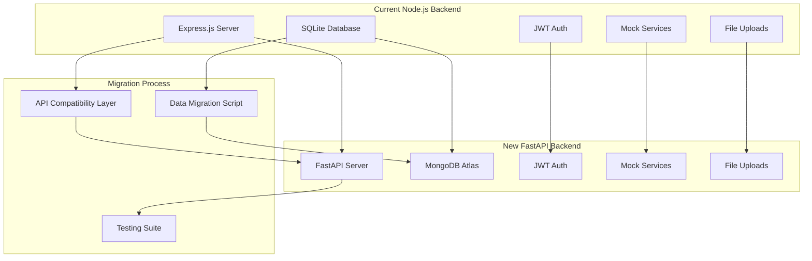
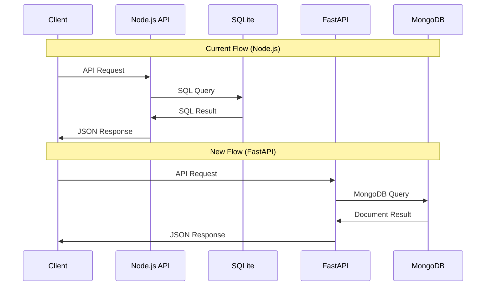

# **COMPREHENSIVE BACKEND MIGRATION PLAN: Node.js to Python FastAPI with MongoDB Atlas**

## **📊 CURRENT BACKEND ANALYSIS**

### **Architecture Overview**
- **Framework**: Express.js with SQLite database
- **Authentication**: JWT-based with bcryptjs
- **File Structure**: Modular design with routes, middleware, services, models
- **Database**: SQLite with 8 main tables
- **Mock Services**: Facebook Ads, Twilio SMS, OpenAI integrations
- **File Handling**: Multer for CSV/image uploads

### **API Endpoints Inventory**
```
Authentication Routes (/api/auth):
├── POST /register - User registration with restaurant creation
├── POST /login - JWT authentication
├── GET /me - Current user info
├── POST /impersonate/:restaurantId - Admin impersonation
└── POST /end-impersonation - End admin impersonation

Dashboard Routes (/api/dashboard):
├── GET /restaurant - Restaurant dashboard data
├── GET /admin - Admin dashboard data
├── GET /restaurants - All restaurants (admin)
├── GET /campaigns - Restaurant campaigns
└── PUT /checklist/:itemId - Update checklist item

Checklist Routes (/api/checklist):
├── GET /categories - Get checklist categories
├── GET /items/:categoryId - Get category items
├── GET /status/:restaurantId - Get restaurant checklist status
├── PUT /status/:restaurantId/:itemId - Update item status
├── GET /progress/:restaurantId - Get progress statistics
└── GET /categories-with-items - Get categories with items

Facebook Ads Routes (/api/facebook-ads):
├── POST /create-campaign - Create Facebook ad campaign
├── GET /campaign-status/:campaignId - Get campaign status
└── POST /generate-preview - Generate ad preview

SMS Campaigns Routes (/api/sms-campaigns):
├── POST /create-campaign - Create SMS campaign
├── POST /preview - Generate SMS preview
├── GET /sample-csv - Download sample CSV
└── GET /campaign-status/:campaignId - Get campaign status
```

### **Database Schema Analysis**
```sql
Current SQLite Tables:
1. users (user_id, email, password_hash, role, created_at)
2. restaurants (restaurant_id, user_id, name, address, phone, created_at)
3. campaigns (campaign_id, restaurant_id, campaign_type, status, name, details, budget)
4. checklist_status (status_id, restaurant_id, checklist_item_name, is_complete)
5. checklist_categories (category_id, name, description, icon, type, order_in_list)
6. checklist_items (item_id, category_id, title, description, guidance_link, order_in_category, is_critical)
7. restaurant_checklist_status (status_id, restaurant_id, item_id, status, notes)
8. sessions (session_id, user_id, impersonating_restaurant_id, created_at, expires_at)
```

## **🎯 MIGRATION STRATEGY**

### **Phase 1: MongoDB Atlas Setup & Data Model Design**

**MongoDB Atlas Configuration:**
```yaml
Environment Structure:
├── Development Database: momentum_dev
├── Staging Database: momentum_staging  
└── Production Database: momentum_prod

Collections Design:
├── users
├── restaurants
├── campaigns
├── checklist_categories
├── checklist_items
├── restaurant_checklist_status
└── sessions
```

**MongoDB Document Models:**
```python
# User Document
{
  "_id": ObjectId,
  "email": str,
  "password_hash": str,
  "role": str,  # "restaurant" | "admin"
  "created_at": datetime,
  "updated_at": datetime
}

# Restaurant Document
{
  "_id": ObjectId,
  "user_id": ObjectId,  # Reference to users
  "name": str,
  "address": str,
  "phone": str,
  "created_at": datetime,
  "updated_at": datetime
}

# Campaign Document
{
  "_id": ObjectId,
  "restaurant_id": ObjectId,  # Reference to restaurants
  "campaign_type": str,  # "ad" | "sms"
  "status": str,  # "active" | "draft" | "completed" | "paused"
  "name": str,
  "details": dict,
  "budget": float,
  "created_at": datetime,
  "updated_at": datetime
}

# Checklist Category Document
{
  "_id": ObjectId,
  "name": str,
  "description": str,
  "icon": str,
  "type": str,  # "foundational" | "ongoing"
  "order_in_list": int,
  "created_at": datetime
}

# Checklist Item Document
{
  "_id": ObjectId,
  "category_id": ObjectId,  # Reference to checklist_categories
  "parent_item_id": ObjectId,  # Optional reference to parent item
  "title": str,
  "description": str,
  "guidance_link": str,
  "order_in_category": int,
  "is_critical": bool,
  "created_at": datetime
}

# Restaurant Checklist Status Document
{
  "_id": ObjectId,
  "restaurant_id": ObjectId,  # Reference to restaurants
  "item_id": ObjectId,  # Reference to checklist_items
  "status": str,  # "pending" | "in_progress" | "completed" | "not_applicable"
  "notes": str,
  "last_updated_at": datetime
}

# Session Document
{
  "_id": ObjectId,
  "session_id": str,
  "user_id": ObjectId,  # Reference to users
  "impersonating_restaurant_id": ObjectId,  # Optional reference to restaurants
  "created_at": datetime,
  "expires_at": datetime
}
```

### **Phase 2: FastAPI Project Structure**

```
backendv2/
├── app/
│   ├── __init__.py
│   ├── main.py                 # FastAPI application entry point
│   ├── config.py              # Configuration settings
│   ├── database.py            # MongoDB connection setup
│   ├── dependencies.py        # Common dependencies
│   ├── models/
│   │   ├── __init__.py
│   │   ├── user.py           # User Pydantic models
│   │   ├── restaurant.py     # Restaurant Pydantic models
│   │   ├── campaign.py       # Campaign Pydantic models
│   │   ├── checklist.py      # Checklist Pydantic models
│   │   └── session.py        # Session Pydantic models
│   ├── schemas/
│   │   ├── __init__.py
│   │   ├── user.py           # User request/response schemas
│   │   ├── restaurant.py     # Restaurant schemas
│   │   ├── campaign.py       # Campaign schemas
│   │   ├── checklist.py      # Checklist schemas
│   │   └── auth.py           # Authentication schemas
│   ├── routers/
│   │   ├── __init__.py
│   │   ├── auth.py           # Authentication endpoints
│   │   ├── dashboard.py      # Dashboard endpoints
│   │   ├── checklist.py      # Checklist endpoints
│   │   ├── facebook_ads.py   # Facebook ads endpoints
│   │   └── sms_campaigns.py  # SMS campaigns endpoints
│   ├── services/
│   │   ├── __init__.py
│   │   ├── auth_service.py   # Authentication business logic
│   │   ├── user_service.py   # User management
│   │   ├── restaurant_service.py # Restaurant management
│   │   ├── campaign_service.py   # Campaign management
│   │   ├── checklist_service.py  # Checklist management
│   │   ├── mock_facebook.py      # Mock Facebook API
│   │   ├── mock_openai.py        # Mock OpenAI API
│   │   └── mock_twilio.py        # Mock Twilio API
│   ├── middleware/
│   │   ├── __init__.py
│   │   ├── auth.py           # JWT authentication middleware
│   │   ├── cors.py           # CORS middleware
│   │   └── error_handler.py  # Global error handling
│   ├── utils/
│   │   ├── __init__.py
│   │   ├── security.py       # Password hashing, JWT utilities
│   │   ├── csv_parser.py     # CSV parsing utilities
│   │   ├── file_handler.py   # File upload handling
│   │   └── validators.py     # Data validation utilities
│   └── core/
│       ├── __init__.py
│       ├── security.py       # Security configurations
│       └── exceptions.py     # Custom exceptions
├── tests/
│   ├── __init__.py
│   ├── conftest.py          # Test configuration
│   ├── test_auth.py         # Authentication tests
│   ├── test_dashboard.py    # Dashboard tests
│   ├── test_checklist.py    # Checklist tests
│   ├── test_facebook_ads.py # Facebook ads tests
│   └── test_sms_campaigns.py # SMS campaigns tests
├── scripts/
│   ├── __init__.py
│   ├── populate_checklist.py # Checklist population script
│   └── migrate_data.py       # Data migration script
├── uploads/                  # File upload directory
├── requirements.txt          # Python dependencies
├── .env.example             # Environment variables template
├── .env                     # Environment variables (gitignored)
├── .gitignore              # Git ignore file
└── README.md               # Project documentation
```

### **Phase 3: Dependencies & Requirements**

```python
# requirements.txt
fastapi==0.104.1
uvicorn[standard]==0.24.0
motor==3.3.2                 # Async MongoDB driver
pymongo==4.6.0              # MongoDB driver
pydantic==2.5.0             # Data validation
pydantic-settings==2.1.0    # Settings management
python-jose[cryptography]==3.3.0  # JWT handling
passlib[bcrypt]==1.7.4      # Password hashing
python-multipart==0.0.6     # File uploads
aiofiles==23.2.1            # Async file operations
python-dotenv==1.0.0        # Environment variables
pytest==7.4.3              # Testing framework
pytest-asyncio==0.21.1     # Async testing
httpx==0.25.2               # HTTP client for testing
```

### **Phase 4: API Compatibility Matrix**

| Current Node.js Endpoint | FastAPI Equivalent | Status | Notes |
|--------------------------|-------------------|---------|-------|
| `POST /api/auth/register` | `POST /api/auth/register` | ✅ Direct | Same request/response format |
| `POST /api/auth/login` | `POST /api/auth/login` | ✅ Direct | Same JWT response |
| `GET /api/auth/me` | `GET /api/auth/me` | ✅ Direct | Same user info response |
| `POST /api/auth/impersonate/:id` | `POST /api/auth/impersonate/{id}` | ✅ Direct | Path param syntax change |
| `POST /api/auth/end-impersonation` | `POST /api/auth/end-impersonation` | ✅ Direct | Same functionality |
| `GET /api/dashboard/restaurant` | `GET /api/dashboard/restaurant` | ✅ Direct | Same response structure |
| `GET /api/dashboard/admin` | `GET /api/dashboard/admin` | ✅ Direct | Same admin data |
| `GET /api/dashboard/restaurants` | `GET /api/dashboard/restaurants` | ✅ Direct | Same search functionality |
| `GET /api/dashboard/campaigns` | `GET /api/dashboard/campaigns` | ✅ Direct | Same campaign list |
| `PUT /api/dashboard/checklist/:id` | `PUT /api/dashboard/checklist/{id}` | ✅ Direct | Path param syntax change |
| All checklist endpoints | All checklist endpoints | ✅ Direct | Same functionality |
| All Facebook ads endpoints | All Facebook ads endpoints | ✅ Direct | Same mock responses |
| All SMS campaign endpoints | All SMS campaign endpoints | ✅ Direct | Same CSV processing |

### **Phase 5: Authentication System Migration**

**JWT Configuration:**
```python
# app/core/security.py
from datetime import datetime, timedelta
from typing import Optional
from jose import JWTError, jwt
from passlib.context import CryptContext

SECRET_KEY = "your-secret-key-change-in-production"
ALGORITHM = "HS256"
ACCESS_TOKEN_EXPIRE_HOURS = 24

pwd_context = CryptContext(schemes=["bcrypt"], deprecated="auto")

def create_access_token(data: dict, expires_delta: Optional[timedelta] = None):
    to_encode = data.copy()
    if expires_delta:
        expire = datetime.utcnow() + expires_delta
    else:
        expire = datetime.utcnow() + timedelta(hours=ACCESS_TOKEN_EXPIRE_HOURS)
    to_encode.update({"exp": expire})
    encoded_jwt = jwt.encode(to_encode, SECRET_KEY, algorithm=ALGORITHM)
    return encoded_jwt

def verify_password(plain_password, hashed_password):
    return pwd_context.verify(plain_password, hashed_password)

def get_password_hash(password):
    return pwd_context.hash(password)
```

**Authentication Middleware:**
```python
# app/middleware/auth.py
from fastapi import HTTPException, status, Depends
from fastapi.security import HTTPBearer, HTTPAuthorizationCredentials
from jose import JWTError, jwt
from app.core.security import SECRET_KEY, ALGORITHM

security = HTTPBearer()

async def get_current_user(credentials: HTTPAuthorizationCredentials = Depends(security)):
    credentials_exception = HTTPException(
        status_code=status.HTTP_401_UNAUTHORIZED,
        detail="Could not validate credentials",
        headers={"WWW-Authenticate": "Bearer"},
    )
    try:
        payload = jwt.decode(credentials.credentials, SECRET_KEY, algorithms=[ALGORITHM])
        user_id: str = payload.get("user_id")
        if user_id is None:
            raise credentials_exception
        return payload
    except JWTError:
        raise credentials_exception

async def require_admin(current_user: dict = Depends(get_current_user)):
    if current_user.get("role") != "admin":
        raise HTTPException(
            status_code=status.HTTP_403_FORBIDDEN,
            detail="Admin access required"
        )
    return current_user

async def require_restaurant(current_user: dict = Depends(get_current_user)):
    if current_user.get("role") != "restaurant" and not current_user.get("impersonating_restaurant_id"):
        raise HTTPException(
            status_code=status.HTTP_403_FORBIDDEN,
            detail="Restaurant access required"
        )
    return current_user
```

### **Phase 6: Data Migration Strategy**

**Migration Script Structure:**
```python
# scripts/migrate_data.py
import asyncio
import sqlite3
from motor.motor_asyncio import AsyncIOMotorClient
from datetime import datetime
from bson import ObjectId

class DataMigrator:
    def __init__(self, sqlite_path: str, mongo_uri: str, db_name: str):
        self.sqlite_path = sqlite_path
        self.mongo_uri = mongo_uri
        self.db_name = db_name
        
    async def migrate_all_data(self):
        # Connect to databases
        sqlite_conn = sqlite3.connect(self.sqlite_path)
        mongo_client = AsyncIOMotorClient(self.mongo_uri)
        mongo_db = mongo_client[self.db_name]
        
        try:
            # Migrate in order due to dependencies
            await self.migrate_users(sqlite_conn, mongo_db)
            await self.migrate_restaurants(sqlite_conn, mongo_db)
            await self.migrate_checklist_categories(sqlite_conn, mongo_db)
            await self.migrate_checklist_items(sqlite_conn, mongo_db)
            await self.migrate_campaigns(sqlite_conn, mongo_db)
            await self.migrate_restaurant_checklist_status(sqlite_conn, mongo_db)
            await self.migrate_sessions(sqlite_conn, mongo_db)
            
        finally:
            sqlite_conn.close()
            mongo_client.close()
    
    async def migrate_users(self, sqlite_conn, mongo_db):
        cursor = sqlite_conn.cursor()
        cursor.execute("SELECT * FROM users")
        users = cursor.fetchall()
        
        user_mapping = {}  # SQLite ID -> MongoDB ObjectId
        
        for user in users:
            mongo_id = ObjectId()
            user_mapping[user[0]] = mongo_id  # user[0] is user_id
            
            user_doc = {
                "_id": mongo_id,
                "email": user[1],
                "password_hash": user[2],
                "role": user[3],
                "created_at": datetime.fromisoformat(user[4]) if user[4] else datetime.utcnow(),
                "updated_at": datetime.utcnow()
            }
            
            await mongo_db.users.insert_one(user_doc)
        
        return user_mapping
```

### **Phase 7: Step-by-Step Implementation Roadmap**

**Week 1: Foundation Setup**
1. ✅ Create `backendv2` directory structure
2. ✅ Set up MongoDB Atlas clusters (dev, staging, prod)
3. ✅ Configure environment variables and connection strings
4. ✅ Install Python dependencies and FastAPI setup
5. ✅ Create base FastAPI application with health check

**Week 2: Data Models & Database**
1. ✅ Define Pydantic models for all entities
2. ✅ Set up MongoDB connection and database utilities
3. ✅ Create data migration scripts
4. ✅ Test data migration with sample data
5. ✅ Implement database indexes for performance

**Week 3: Authentication System**
1. ✅ Implement JWT authentication middleware
2. ✅ Create user registration and login endpoints
3. ✅ Add admin impersonation functionality
4. ✅ Test authentication flows
5. ✅ Implement role-based access control

**Week 4: Core API Endpoints**
1. ✅ Implement dashboard endpoints
2. ✅ Create checklist management endpoints
3. ✅ Add restaurant management functionality
4. ✅ Test API compatibility with existing frontend
5. ✅ Implement error handling and validation

**Week 5: Campaign Features**
1. ✅ Port Facebook Ads mock service
2. ✅ Port SMS campaigns functionality
3. ✅ Implement file upload handling
4. ✅ Add CSV parsing utilities
5. ✅ Test campaign creation flows

**Week 6: Testing & Optimization**
1. ✅ Write comprehensive unit tests
2. ✅ Perform integration testing
3. ✅ Load testing and performance optimization
4. ✅ Security audit and vulnerability testing
5. ✅ Documentation and API specification

**Week 7: Deployment & Migration**
1. ✅ Set up production environment
2. ✅ Perform full data migration
3. ✅ Deploy FastAPI application
4. ✅ Update frontend API endpoints
5. ✅ Monitor and validate functionality

## **🔧 TECHNICAL CONSIDERATIONS**

### **Database Indexes for Performance**
```python
# MongoDB Indexes to create
await db.users.create_index("email", unique=True)
await db.restaurants.create_index("user_id")
await db.campaigns.create_index([("restaurant_id", 1), ("status", 1)])
await db.restaurant_checklist_status.create_index([("restaurant_id", 1), ("item_id", 1)], unique=True)
await db.checklist_items.create_index("category_id")
await db.sessions.create_index("expires_at", expireAfterSeconds=0)  # TTL index
```

### **Environment Configuration**
```python
# app/config.py
from pydantic_settings import BaseSettings

class Settings(BaseSettings):
    # Database
    MONGODB_URL: str
    DATABASE_NAME: str
    
    # Security
    SECRET_KEY: str
    ALGORITHM: str = "HS256"
    ACCESS_TOKEN_EXPIRE_HOURS: int = 24
    
    # File Upload
    UPLOAD_DIR: str = "uploads"
    MAX_FILE_SIZE: int = 5 * 1024 * 1024  # 5MB
    
    # External APIs (Mock)
    OPENAI_API_KEY: str = "mock-key"
    FACEBOOK_ACCESS_TOKEN: str = "mock-token"
    TWILIO_ACCOUNT_SID: str = "mock-sid"
    
    class Config:
        env_file = ".env"

settings = Settings()
```

### **Error Handling Strategy**
```python
# app/core/exceptions.py
from fastapi import HTTPException, status

class AuthenticationError(HTTPException):
    def __init__(self, detail: str = "Authentication failed"):
        super().__init__(status_code=status.HTTP_401_UNAUTHORIZED, detail=detail)

class AuthorizationError(HTTPException):
    def __init__(self, detail: str = "Access denied"):
        super().__init__(status_code=status.HTTP_403_FORBIDDEN, detail=detail)

class NotFoundError(HTTPException):
    def __init__(self, detail: str = "Resource not found"):
        super().__init__(status_code=status.HTTP_404_NOT_FOUND, detail=detail)

class ValidationError(HTTPException):
    def __init__(self, detail: str = "Validation failed"):
        super().__init__(status_code=status.HTTP_422_UNPROCESSABLE_ENTITY, detail=detail)
```

## **📋 MIGRATION CHECKLIST**

### **Pre-Migration**
- [ ] MongoDB Atlas clusters created (dev, staging, prod)
- [ ] Connection strings configured
- [ ] FastAPI project structure created
- [ ] Dependencies installed
- [ ] Environment variables configured

### **Data Migration**
- [ ] SQLite data exported
- [ ] MongoDB collections created
- [ ] Data transformation scripts tested
- [ ] Full data migration completed
- [ ] Data integrity verified

### **API Migration**
- [ ] All endpoints implemented
- [ ] Authentication system working
- [ ] File upload functionality tested
- [ ] Mock services ported
- [ ] API compatibility verified

### **Testing & Validation**
- [ ] Unit tests passing
- [ ] Integration tests passing
- [ ] Frontend compatibility confirmed
- [ ] Performance benchmarks met
- [ ] Security audit completed

### **Deployment**
- [ ] Production environment configured
- [ ] Application deployed
- [ ] Database connections verified
- [ ] Monitoring setup
- [ ] Rollback plan prepared

## **🚀 NEXT STEPS**

1. **Review and approve this migration plan**
2. **Set up MongoDB Atlas clusters**
3. **Begin FastAPI project structure creation**
4. **Start with authentication system implementation**
5. **Proceed with phased migration approach**

## **📊 MIGRATION ARCHITECTURE DIAGRAM**



## **🔄 DATA FLOW COMPARISON**



This comprehensive migration plan maintains 100% API compatibility while modernizing the backend architecture with FastAPI and MongoDB Atlas. The database-per-environment approach ensures proper separation of concerns and safe deployment practices.