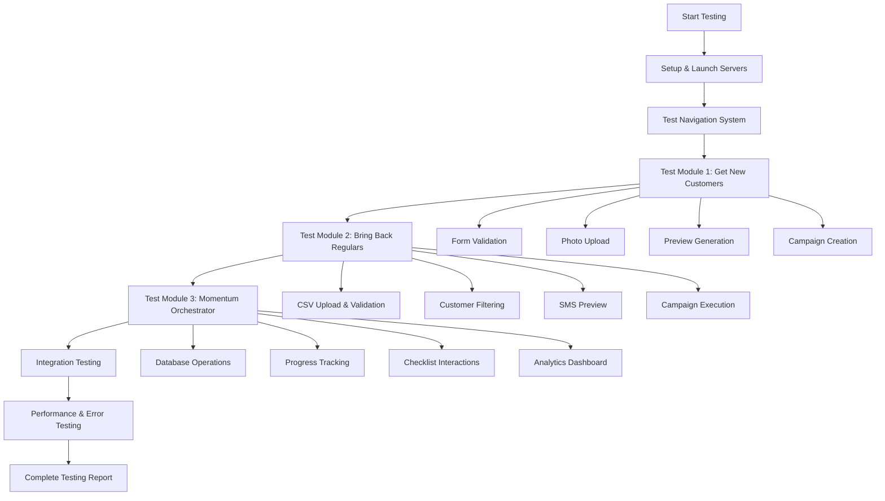

# 🧪 Comprehensive Testing Plan for Momentum Growth Starter

## 📋 Application Overview
- **Frontend**: React app (port 3000) with 3 main modules
- **Backend**: Node.js/Express server (port 5001) with SQLite database
- **Architecture**: Full-stack application with mock API integrations

## 🎯 Testing Strategy

## 🚀 Phase 1: Environment Setup & Server Launch

### Objectives:
- Verify both servers start correctly
- Confirm database connectivity
- Test basic API health endpoints

### Test Steps:

#### 1. Backend Server Setup
- Install dependencies: `npm install` in server directory
- Start server: `npm start` (should run on port 5001)
- Verify database connection and tables exist
- Test health endpoint: `GET /api/health`

#### 2. Frontend Server Setup
- Install dependencies: `npm install` in client directory
- Start React app: `npm start` (should run on port 3000)
- Verify proxy configuration to backend

#### 3. Initial Connectivity Test
- Confirm frontend can reach backend APIs
- Check browser console for any initial errors

## 🧭 Phase 2: Navigation System Testing

### Objectives:
- Verify tab switching functionality
- Test responsive design
- Confirm state management works

### Test Cases:
- Click between all three tabs
- Verify active tab highlighting
- Check that components load correctly
- Test dark mode toggle functionality

## 🎯 Phase 3: Get New Customers Module Testing

### Objectives:
- Test Facebook ads campaign creation workflow
- Validate form inputs and file uploads
- Test preview functionality and API integrations

### Detailed Test Cases:

#### 1. Form Validation Testing
- Submit empty form (should show validation errors)
- Test each required field individually
- Verify budget dropdown options ($10, $20)

#### 2. Photo Upload Testing
- Upload valid image files (JPEG, PNG, GIF)
- Test file size validation (5MB limit)
- Try invalid file types (should reject)
- Verify preview image display

#### 3. Preview Generation
- Fill form with valid data
- Click "Preview Ad Copy" button
- Verify generated ad copy appears
- Check promo code generation
- Validate character count display

#### 4. Campaign Creation
- Complete full form submission
- Verify success message and campaign details
- Check all returned data fields:
  - Promo code
  - Expected reach
  - Estimated impressions
  - Campaign URL
  - Next steps instructions

## 📱 Phase 4: Bring Back Regulars Module Testing

### Objectives:
- Test SMS campaign workflow with CSV processing
- Validate customer data parsing and filtering
- Test preview and campaign execution

### Detailed Test Cases:

#### 1. CSV Upload & Validation
- Download sample CSV file
- Upload valid CSV with customer data
- Test file size validation (2MB limit)
- Try invalid file formats (should reject)
- Test CSV parsing with various data formats

#### 2. Customer Data Processing
- Upload CSV with mixed customer data
- Verify lapsed customer filtering (>30 days)
- Check error handling for invalid rows
- Validate customer count statistics

#### 3. SMS Preview Generation
- Fill form with restaurant details and offer
- Generate SMS preview with uploaded CSV
- Verify personalized message generation
- Check character count (160 limit)
- Validate cost estimation

#### 4. Campaign Execution
- Submit complete SMS campaign
- Verify success response with metrics:
  - Messages sent count
  - Delivery rate
  - Total cost
  - Sample message
  - CSV analysis results

## 📋 Phase 5: Momentum Orchestrator Module Testing

### Objectives:
- Test comprehensive checklist system
- Validate database operations
- Test progress tracking and analytics

### Detailed Test Cases:

#### 1. Database Operations
- Verify checklist categories load correctly
- Check foundational vs ongoing item separation
- Test item status persistence
- Validate critical item marking

#### 2. Interactive Checklist
- Click checkboxes to mark items complete
- Verify status updates persist
- Test category expansion/collapse
- Check external link functionality

#### 3. Progress Analytics
- Monitor overall marketing score calculation
- Verify progress bars update correctly
- Test achievement badge system
- Check revenue potential calculations

#### 4. Advanced Features
- Test smart recommendations
- Verify category progress tracking
- Check critical item prioritization
- Validate completion celebrations

## 🔄 Phase 6: Integration Testing

### Objectives:
- Test cross-module functionality
- Verify data persistence across sessions
- Test error handling and recovery

### Test Scenarios:
- Switch between modules while maintaining state
- Test browser refresh behavior
- Verify localStorage persistence
- Test concurrent user scenarios

## ⚡ Phase 7: Performance & Error Testing

### Objectives:
- Test application under various conditions
- Validate error handling
- Check performance metrics

### Test Cases:
- Large file uploads
- Network connectivity issues
- Invalid API responses
- Browser compatibility
- Mobile responsiveness

## 📊 Expected Test Results

### Success Criteria:
- All three modules function independently
- Form validations work correctly
- File uploads process successfully
- Database operations complete without errors
- Progress tracking updates accurately
- Mock API integrations return expected responses
- UI remains responsive across all interactions

### Key Metrics to Validate:
- Server response times < 2 seconds
- File upload success rate 100%
- Database query completion
- Frontend state management consistency
- Error handling graceful degradation

## 🎯 Testing Execution Order

1. **Setup Phase** (5 minutes)
2. **Navigation Testing** (5 minutes)
3. **Get New Customers** (15 minutes)
4. **Bring Back Regulars** (15 minutes)
5. **Momentum Orchestrator** (20 minutes)
6. **Integration Testing** (10 minutes)
7. **Performance Testing** (10 minutes)

**Total Estimated Time: ~80 minutes**

## 📝 Test Results Template

### Phase 1: Environment Setup
- [ ] Backend server starts successfully
- [ ] Frontend server starts successfully
- [ ] Database connectivity confirmed
- [ ] Health endpoint responds correctly

### Phase 2: Navigation System
- [ ] Tab switching works
- [ ] Active tab highlighting
- [ ] Component loading
- [ ] Dark mode toggle

### Phase 3: Get New Customers
- [ ] Form validation
- [ ] Photo upload
- [ ] Preview generation
- [ ] Campaign creation

### Phase 4: Bring Back Regulars
- [ ] CSV upload & validation
- [ ] Customer data processing
- [ ] SMS preview generation
- [ ] Campaign execution

### Phase 5: Momentum Orchestrator
- [ ] Database operations
- [ ] Interactive checklist
- [ ] Progress analytics
- [ ] Advanced features

### Phase 6: Integration Testing
- [ ] Cross-module functionality
- [ ] Data persistence
- [ ] Error handling

### Phase 7: Performance Testing
- [ ] Response times
- [ ] File upload performance
- [ ] Error scenarios
- [ ] Browser compatibility

## 🎯 Next Steps

This comprehensive testing plan will validate all major functionality across the three core modules, ensuring the application works as designed and provides a smooth user experience for restaurant owners looking to grow their business.

After completing all test phases, a detailed report will be generated with:
- Test results summary
- Issues identified
- Performance metrics
- Recommendations for improvements