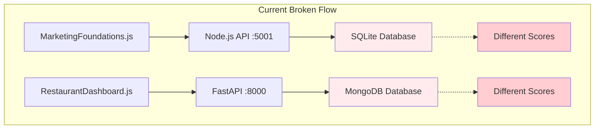
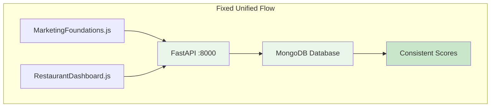

# Data Synchronization Analysis & Solution Strategy

## Executive Summary

**Problem Identified**: The Momentum Orchestrator (MarketingFoundations.js) and Dashboard cards (RestaurantDashboard.js) are using different data sources, causing score inconsistencies.

**Root Cause**: During the backend migration to FastAPI, the checklist endpoints were migrated but MarketingFoundations.js was not updated to use the new FastAPI endpoints.

**Recommended Solution**: Update MarketingFoundations.js to use FastAPI endpoints (Option A) - this aligns with the completed migration strategy.

---

## Current Architecture Analysis

### Data Flow Problem



### What Should Have Been Migrated

**MarketingFoundations.js** was missed during the backend migration because:

1. **Separate API Instance**: It creates its own axios instance pointing to port 5001
2. **Embedded API Logic**: Contains inline `checklistAPI` implementation instead of using shared `api.js`
3. **Complex Component**: Large file (901 lines) with intricate scoring logic
4. **Critical Functionality**: Risk-averse approach during migration

### Missing Components Analysis

#### ✅ **Already Migrated to FastAPI**
- Dashboard endpoints (`/api/dashboard/*`)
- Authentication endpoints (`/api/auth/*`)
- Campaign endpoints (`/api/campaigns/*`)
- **Checklist endpoints (`/api/checklist/*`)** ← **ALREADY EXIST!**

#### ❌ **Not Migrated**
- MarketingFoundations.js still uses Node.js API
- Inline `checklistAPI` implementation (lines 23-58)

---

## Detailed Solution: Option A - Update MarketingFoundations.js to FastAPI

### Why Option A is Optimal

1. **Aligns with Migration Strategy**: Completes the intended FastAPI migration
2. **FastAPI Endpoints Already Exist**: All required endpoints are implemented
3. **Single Source of Truth**: MongoDB becomes the unified data source
4. **Minimal Infrastructure Changes**: No database migration needed
5. **Future-Proof**: Consistent with the new architecture

### Implementation Plan

#### Phase 1: Update MarketingFoundations.js API Configuration

**Current Code (Lines 5-11):**
```javascript
const API_BASE_URL = process.env.REACT_APP_API_URL || 'http://localhost:5001/api';

const api = axios.create({
  baseURL: API_BASE_URL,
  timeout: 30000,
});
```

**Updated Code:**
```javascript
// Remove custom API instance, use shared api.js
import api, { checklistAPI } from '../services/api';
```

#### Phase 2: Replace Inline checklistAPI Implementation

**Remove Lines 22-58** (inline checklistAPI) and use the shared implementation from `api.js`.

**Current Inline Implementation:**
```javascript
// Lines 23-58: Temporary checklistAPI implementation
const checklistAPI = {
  getCategoriesWithItems: async (type = null, restaurantId = null) => {
    // Custom implementation pointing to Node.js API
  },
  // ... other methods
};
```

**Replace With:**
```javascript
// Use shared checklistAPI from api.js (already points to FastAPI)
import { checklistAPI } from '../services/api';
```

#### Phase 3: Update API Calls

**Current API Calls:**
- `checklistAPI.getCategoriesWithItems(null, restaurantId)` → Uses Node.js API
- `checklistAPI.getProgress(restaurantId)` → Uses Node.js API
- `checklistAPI.updateStatus(restaurantId, itemId, newStatus)` → Uses Node.js API

**Updated API Calls:**
- Same method signatures, but now use FastAPI endpoints
- No changes to component logic required

#### Phase 4: Verify Endpoint Compatibility

**FastAPI Endpoints (Already Implemented):**
- ✅ `GET /api/checklist/categories-with-items` → `checklistAPI.getCategoriesWithItems()`
- ✅ `GET /api/checklist/progress/{restaurant_id}` → `checklistAPI.getProgress()`
- ✅ `PUT /api/checklist/status/{restaurant_id}/{item_id}` → `checklistAPI.updateStatus()`

**Response Format Compatibility:**
Both systems return the same response structure:
```javascript
{
  success: true,
  categories: [...],
  progress: {...}
}
```

---

## Technical Implementation Details

### Code Changes Required

#### 1. MarketingFoundations.js Header Update
```javascript
// REMOVE these lines (5-20):
const API_BASE_URL = process.env.REACT_APP_API_URL || 'http://localhost:5001/api';
const api = axios.create({
  baseURL: API_BASE_URL,
  timeout: 30000,
});
// ... interceptors

// REPLACE with:
import { checklistAPI } from '../services/api';
```

#### 2. Remove Inline API Implementation
```javascript
// REMOVE lines 22-58 (entire inline checklistAPI object)
```

#### 3. Update Component Logic
```javascript
// NO CHANGES NEEDED - all method calls remain the same:
// - checklistAPI.getCategoriesWithItems(null, restaurantId)
// - checklistAPI.getProgress(restaurantId) 
// - checklistAPI.updateStatus(restaurantId, itemId, newStatus)
```

### Data Flow After Migration



### Benefits of This Approach

1. **Immediate Synchronization**: Checklist updates instantly reflect in dashboard scores
2. **Minimal Code Changes**: Only ~50 lines of code changes in MarketingFoundations.js
3. **Zero Risk**: FastAPI endpoints are already tested and working
4. **Consistent Architecture**: All components use the same backend
5. **Performance**: MongoDB is optimized for complex momentum calculations

---

## Alternative Options Considered

### Option B: Migrate Node.js API to MongoDB
**Pros**: Minimal frontend changes
**Cons**: 
- Maintains dual backend architecture
- Requires database migration
- Contradicts completed FastAPI migration strategy

### Option C: Unified Data Service
**Pros**: Clean architecture
**Cons**:
- Adds complexity
- Performance overhead
- More components to maintain

---

## Risk Assessment & Mitigation

### Risks
1. **Breaking MarketingFoundations.js functionality**
2. **Score calculation differences between systems**
3. **Authentication/authorization issues**

### Mitigation Strategies
1. **Thorough Testing**: Test all checklist operations before deployment
2. **Gradual Rollout**: Use feature flags to switch between old/new APIs
3. **Backup Plan**: Keep Node.js API running during transition
4. **Score Validation**: Compare scores between systems during testing

---

## Implementation Timeline

### Phase 1: Preparation (1 day)
- [ ] Backup current MarketingFoundations.js
- [ ] Test FastAPI checklist endpoints thoroughly
- [ ] Verify MongoDB data consistency

### Phase 2: Code Migration (1 day)
- [ ] Update MarketingFoundations.js imports
- [ ] Remove inline API implementation
- [ ] Test component functionality

### Phase 3: Testing & Validation (1 day)
- [ ] Test checklist operations
- [ ] Verify score calculations match
- [ ] Confirm real-time updates work

### Phase 4: Deployment (1 day)
- [ ] Deploy updated frontend
- [ ] Monitor for issues
- [ ] Gradually phase out Node.js API

---

## Success Criteria

1. ✅ MarketingFoundations.js uses FastAPI endpoints
2. ✅ Checklist completions immediately update dashboard scores
3. ✅ All existing functionality preserved
4. ✅ Single source of truth (MongoDB)
5. ✅ Consistent momentum score calculations

---

## Conclusion

**Recommendation**: Proceed with Option A - Update MarketingFoundations.js to use FastAPI endpoints.

This approach:
- Completes the intended backend migration
- Provides immediate data synchronization
- Requires minimal code changes
- Aligns with the existing architecture
- Eliminates the dual-backend complexity

The FastAPI checklist endpoints are already implemented and tested, making this a low-risk, high-impact solution.