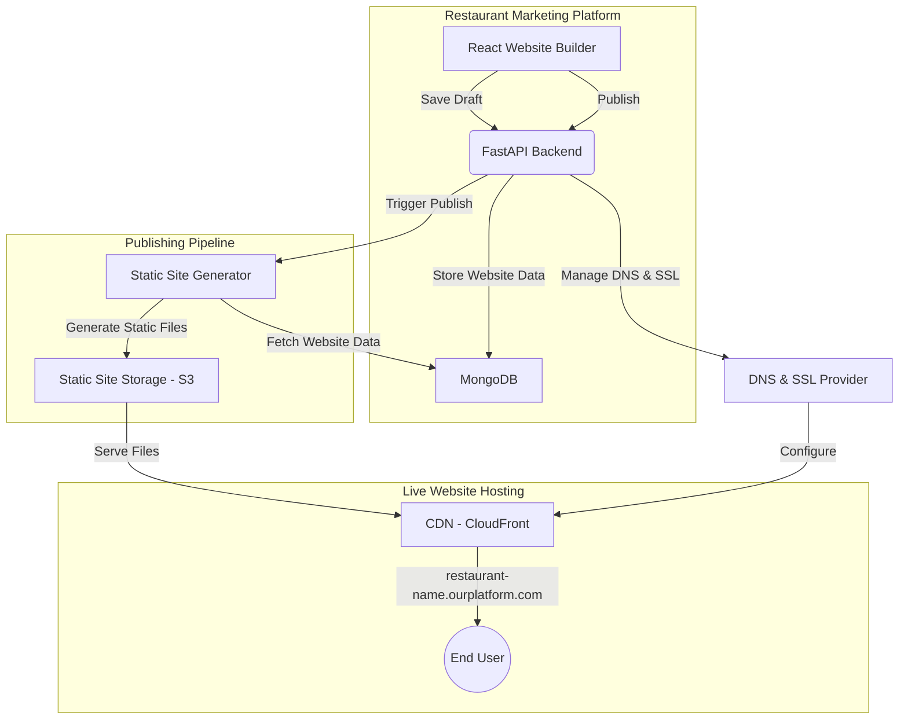

# Live Website Publishing System - Development Plan

## Overview

This document outlines the comprehensive development plan for implementing a live website publishing system for the restaurant marketing platform's website builder. The system allows users to publish their restaurant websites to live, publicly accessible URLs with proper performance, SEO, and domain management.

## Architecture Overview



## Phase 1: Core Backend and Data Model ✅ COMPLETED

### Implementation Summary

**✅ Extended RestaurantWebsite Model**
- Added new fields to support publishing:
  - `live_url`: Live published URL (e.g., restaurant-name.ourplatform.com)
  - `published_content`: Snapshot of content when published
  - `subdomain`: Generated subdomain for the restaurant
  - `ssl_certificate_arn`: AWS ACM certificate ARN for HTTPS
  - `cdn_distribution_id`: CloudFront distribution ID
  - `static_files_bucket`: S3 bucket storing static files
  - `last_published_at`: When the website was last published
  - `has_unpublished_changes`: True if draft differs from published version

**✅ Created Publishing Request/Response Models**
- `WebsitePublishRequest`: Request model for publishing
- `WebsitePublishResponse`: Response model with live URL and deployment info
- `WebsiteUnpublishRequest`: Request model for unpublishing
- `WebsiteUnpublishResponse`: Response model for unpublish operations
- `WebsitePublishStatusResponse`: Response model for status queries

**✅ Implemented Publishing Service**
- Created `WebsitePublishingService` class with comprehensive functionality:
  - `publish_website()`: Handles the complete publishing process
  - `unpublish_website()`: Takes websites offline
  - `get_publish_status()`: Returns current publishing status
  - `mark_website_as_changed()`: Marks websites as having unpublished changes
  - Subdomain generation with collision detection
  - Content snapshot creation for published versions
  - Website validation before publishing

**✅ Created Publishing API Endpoints**
- `POST /api/website-builder/websites/{website_id}/publish`: Publish website
- `POST /api/website-builder/websites/{website_id}/unpublish`: Unpublish website
- `GET /api/website-builder/websites/{website_id}/publish-status`: Get status

**✅ Integrated Change Tracking**
- Added hooks to mark websites as having unpublished changes when edited
- Automatic tracking of draft vs. published state differences

### Files Created/Modified
- `backendv2/app/models_website_builder.py`: Extended models
- `backendv2/app/services/website_publishing_service.py`: New service
- `backendv2/app/routes/website_builder.py`: New endpoints
- `backendv2/test_website_publishing.py`: Test script

---

## Phase 2: Static Site Generation (SSG) 🚧 NEXT

### Technical Approach

**Static Site Generator Service**
```python
class StaticSiteGeneratorService:
    async def generate_static_site(self, website_data: Dict) -> Dict[str, str]:
        """Generate complete static HTML/CSS/JS from website data"""
        
    async def render_page(self, page_data: Dict, global_data: Dict) -> str:
        """Render individual page to HTML"""
        
    async def generate_assets(self, website_data: Dict) -> Dict[str, str]:
        """Generate CSS, JS, and other assets"""
        
    async def optimize_images(self, images: List[str]) -> List[str]:
        """Optimize and compress images for web"""
```

**Implementation Steps**
1. **Create Template Engine**
   - Design HTML templates for each component type
   - Implement template rendering with Jinja2 or similar
   - Create responsive CSS framework

2. **Component Rendering System**
   - Map React components to HTML templates
   - Handle dynamic content injection
   - Implement responsive design breakpoints

3. **Asset Generation**
   - Generate optimized CSS from design system
   - Create JavaScript for interactive elements
   - Implement image optimization pipeline

4. **Storage Integration**
   - Set up AWS S3 bucket for static files
   - Implement file upload and organization
   - Configure proper permissions and access

### Key Considerations
- **Performance**: Minimize file sizes, optimize images
- **SEO**: Generate proper meta tags, structured data
- **Responsive**: Ensure mobile-first design
- **Accessibility**: Follow WCAG guidelines

---

## Phase 3: CDN and Domain Management 🔄 PLANNED

### Technical Approach

**CDN Integration (AWS CloudFront)**
```python
class CDNService:
    async def create_distribution(self, bucket_name: str, subdomain: str) -> str:
        """Create CloudFront distribution for static site"""
        
    async def invalidate_cache(self, distribution_id: str, paths: List[str]):
        """Invalidate CDN cache after updates"""
        
    async def configure_custom_domain(self, distribution_id: str, domain: str):
        """Configure custom domain with SSL"""
```

**DNS Management (AWS Route 53)**
```python
class DNSService:
    async def create_subdomain(self, subdomain: str, target: str) -> bool:
        """Create DNS record for subdomain"""
        
    async def setup_ssl_certificate(self, domain: str) -> str:
        """Request and configure SSL certificate"""
```

**Implementation Steps**
1. **CloudFront Setup**
   - Create distribution configurations
   - Set up origin access identity
   - Configure caching policies
   - Implement cache invalidation

2. **DNS Configuration**
   - Set up Route 53 hosted zone
   - Implement subdomain creation
   - Configure CNAME records

3. **SSL Automation**
   - Integrate with AWS Certificate Manager
   - Automate certificate provisioning
   - Handle certificate renewal

---

## Phase 4: Frontend Integration 🎨 PLANNED

### UI Components to Add

**Publishing Controls**
```jsx
const PublishingPanel = ({ website, onPublish, onUnpublish }) => {
  return (
    <div className="publishing-panel">
      <PublishStatus website={website} />
      <PublishButton onClick={onPublish} disabled={!website.isValid} />
      <LiveURLDisplay url={website.liveUrl} />
      <UnpublishedChangesAlert visible={website.hasUnpublishedChanges} />
    </div>
  );
};
```

**Status Indicators**
- Draft/Published state badges
- Unpublished changes notifications
- Publishing progress indicators
- Live URL display and sharing

**Implementation Steps**
1. **Add Publishing UI to Website Builder**
   - Create publishing panel component
   - Add publish/unpublish buttons
   - Implement status indicators

2. **State Management**
   - Track published vs. draft states
   - Handle publishing workflow
   - Manage loading states

3. **User Experience**
   - Clear visual feedback
   - Progress indicators
   - Error handling and recovery

---

## Phase 5: Advanced SEO & Analytics 🔍 CRITICAL

### On-Page SEO Automation

**Meta Tag Generation**
```python
class SEOService:
    def generate_meta_tags(self, page_data: Dict, restaurant_data: Dict) -> Dict:
        """Auto-generate optimized meta tags"""
        return {
            "title": f"{restaurant_data['name']} - {page_data['title']}",
            "description": self.optimize_description(page_data['content']),
            "keywords": self.extract_keywords(restaurant_data, page_data),
            "og:title": f"{restaurant_data['name']} - Great Food & Service",
            "og:description": page_data['meta_description'],
            "og:image": restaurant_data['hero_image'],
            "og:type": "restaurant",
            "twitter:card": "summary_large_image"
        }
```

**Structured Data (Schema Markup)**
```python
def generate_restaurant_schema(self, restaurant_data: Dict) -> Dict:
    """Generate Restaurant schema markup"""
    return {
        "@context": "https://schema.org",
        "@type": "Restaurant",
        "name": restaurant_data['name'],
        "address": {
            "@type": "PostalAddress",
            "streetAddress": restaurant_data['address'],
            "addressLocality": restaurant_data['city'],
            "addressRegion": restaurant_data['state'],
            "postalCode": restaurant_data['zip']
        },
        "telephone": restaurant_data['phone'],
        "url": restaurant_data['live_url'],
        "menu": restaurant_data['menu_url'],
        "servesCuisine": restaurant_data['cuisine_type'],
        "priceRange": restaurant_data['price_range']
    }
```

**Technical SEO Features**
- Automatic sitemap.xml generation
- Robots.txt configuration
- Canonical URL implementation
- Image alt-text generation
- Proper heading structure (H1, H2, etc.)

### Implementation Priority
This phase is **CRITICAL** for restaurant success as SEO drives most of their business.

---

## Phase 6: Future Enhancements 🚀 ROADMAP

### Custom Domain Support
- Domain verification system
- DNS configuration automation
- SSL certificate management for custom domains
- Domain transfer and management tools

### Advanced Analytics
- Built-in analytics dashboard
- Performance monitoring
- SEO ranking tracking
- Conversion tracking

### Performance Optimization
- Advanced caching strategies
- Image optimization and WebP conversion
- Lazy loading implementation
- Core Web Vitals optimization

---

## Implementation Timeline

| Phase | Duration | Dependencies | Priority |
|-------|----------|--------------|----------|
| Phase 1 | ✅ Complete | None | Critical |
| Phase 2 | 1-2 weeks | Phase 1 | Critical |
| Phase 3 | 1 week | Phase 2 | High |
| Phase 4 | 1 week | Phase 1-3 | High |
| Phase 5 | 2 weeks | Phase 2-4 | Critical |
| Phase 6 | 2-4 weeks | All phases | Medium |

## Technical Requirements

### Infrastructure
- **AWS Services**: S3, CloudFront, Route 53, Certificate Manager
- **Database**: MongoDB (existing)
- **Backend**: FastAPI (existing)
- **Frontend**: React (existing)

### Dependencies
- **Python Packages**: `boto3`, `jinja2`, `pillow`, `cssmin`, `jsmin`
- **AWS Permissions**: S3, CloudFront, Route 53, ACM access
- **Domain**: Base domain for subdomains (e.g., `ourplatform.com`)

### Security Considerations
- SSL/TLS encryption for all published sites
- Secure API endpoints with proper authentication
- Content validation and sanitization
- Rate limiting for publishing operations

## Success Metrics

### Technical Metrics
- **Performance**: Page load times < 3 seconds
- **SEO**: Lighthouse scores > 90
- **Uptime**: 99.9% availability
- **Security**: SSL A+ rating

### Business Metrics
- **User Adoption**: % of users who publish websites
- **SEO Impact**: Improved search rankings for published sites
- **Customer Satisfaction**: Positive feedback on published sites
- **Revenue Impact**: Increased customer acquisition through published sites

## Conclusion

This development plan provides a comprehensive roadmap for implementing a robust, scalable live website publishing system. Phase 1 has been successfully completed, establishing the foundation for the remaining phases. The focus on SEO optimization in Phase 5 is particularly important for restaurant success, as search visibility directly impacts their business growth.

The system is designed to be:
- **Scalable**: Handle multiple restaurants and high traffic
- **Performant**: Fast loading times and optimal user experience  
- **SEO-Optimized**: Maximum search engine visibility
- **User-Friendly**: Simple publishing workflow for restaurant owners
- **Maintainable**: Clean architecture and comprehensive testing

Next steps: Begin Phase 2 implementation with the Static Site Generation service.