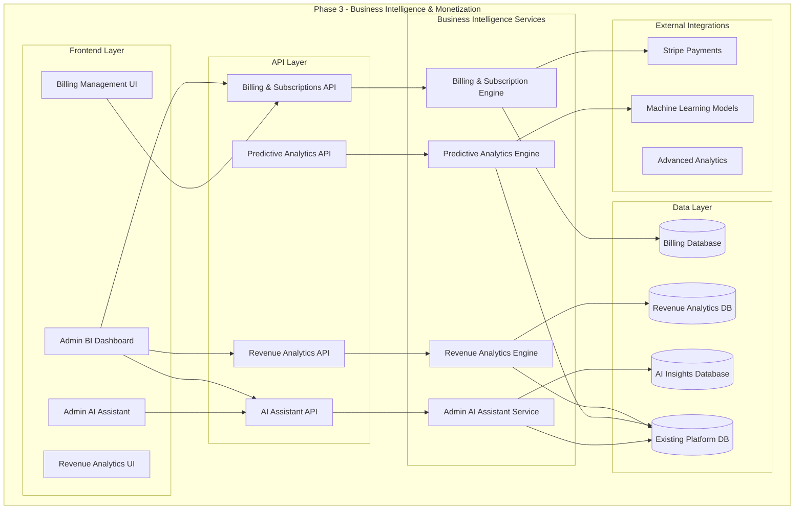

# Phase 3: Business Intelligence & Insights System Architecture

## Executive Summary

Phase 3 transforms the Momentum Growth platform into a comprehensive business intelligence and monetization system. The architecture focuses on subscription management, billing automation, campaign credit systems, and an intelligent admin AI assistant that provides strategic insights for platform growth and optimization.

## Table of Contents

1. [System Architecture Overview](#system-architecture-overview)
2. [Monetization & Billing System](#monetization--billing-system)
3. [Revenue Analytics Engine](#revenue-analytics-engine)
4. [Admin AI Assistant](#admin-ai-assistant)
5. [Predictive Analytics System](#predictive-analytics-system)
6. [Advanced Reporting & Insights](#advanced-reporting--insights)
7. [Implementation Roadmap](#implementation-roadmap)
8. [Success Metrics & KPIs](#success-metrics--kpis)
9. [Risk Mitigation & Security](#risk-mitigation--security)

## System Architecture Overview



## Monetization & Billing System

### 1.1 Subscription Management Architecture

**Database Schema:**

#### Subscription Plans
```python
subscription_plans = {
    "plan_id": str,
    "name": str,  # "Starter", "Professional", "Enterprise"
    "price_monthly": float,
    "price_yearly": float,
    "features": {
        "ai_requests_per_month": int,
        "campaign_credits": int,
        "advanced_analytics": bool,
        "priority_support": bool,
        "custom_integrations": bool
    },
    "stripe_price_id": str,
    "active": bool,
    "created_at": datetime
}
```

#### Restaurant Subscriptions
```python
restaurant_subscriptions = {
    "subscription_id": str,
    "restaurant_id": str,
    "plan_id": str,
    "status": str,  # "active", "canceled", "past_due", "trialing"
    "current_period_start": datetime,
    "current_period_end": datetime,
    "stripe_subscription_id": str,
    "trial_end": datetime,
    "cancel_at_period_end": bool,
    "usage_tracking": {
        "ai_requests_used": int,
        "campaign_credits_used": int,
        "last_reset_date": datetime
    },
    "created_at": datetime,
    "updated_at": datetime
}
```

#### Billing History
```python
billing_invoices = {
    "invoice_id": str,
    "restaurant_id": str,
    "subscription_id": str,
    "stripe_invoice_id": str,
    "amount": float,
    "currency": str,
    "status": str,  # "paid", "pending", "failed"
    "invoice_date": datetime,
    "due_date": datetime,
    "paid_date": datetime,
    "line_items": [
        {
            "description": str,
            "amount": float,
            "quantity": int
        }
    ],
    "created_at": datetime
}
```

#### Campaign Credits System
```python
campaign_credits = {
    "credit_id": str,
    "restaurant_id": str,
    "credit_type": str,  # "facebook_ads", "sms_campaigns", "content_generation"
    "credits_purchased": int,
    "credits_used": int,
    "credits_remaining": int,
    "purchase_date": datetime,
    "expiry_date": datetime,
    "cost_per_credit": float,
    "total_cost": float,
    "stripe_payment_intent_id": str
}
```

### 1.2 Billing Engine Service

```python
class BillingEngineService:
    """
    Comprehensive billing and subscription management service
    """
    
    async def create_subscription(self, restaurant_id: str, plan_id: str, payment_method_id: str):
        """Create new subscription with Stripe integration"""
        
    async def upgrade_subscription(self, restaurant_id: str, new_plan_id: str):
        """Upgrade/downgrade subscription with prorated billing"""
        
    async def cancel_subscription(self, restaurant_id: str, cancel_immediately: bool = False):
        """Cancel subscription with optional immediate termination"""
        
    async def process_usage_billing(self, restaurant_id: str):
        """Process overage charges for usage-based billing"""
        
    async def purchase_campaign_credits(self, restaurant_id: str, credit_type: str, quantity: int):
        """Purchase additional campaign credits"""
        
    async def track_feature_usage(self, restaurant_id: str, feature_type: str, usage_amount: int):
        """Track feature usage against subscription limits"""
        
    async def generate_invoice(self, restaurant_id: str, billing_period: tuple):
        """Generate detailed invoice with usage breakdown"""
        
    async def handle_failed_payment(self, restaurant_id: str, invoice_id: str):
        """Handle failed payment scenarios with grace periods"""
```

### 1.3 Subscription Plans Structure

#### Starter Plan ($49/month)
- 100 AI requests per month
- 50 campaign credits
- Basic analytics
- Email support
- Standard integrations

#### Professional Plan ($99/month)
- 500 AI requests per month
- 200 campaign credits
- Advanced analytics
- Priority support
- Custom integrations
- A/B testing features

#### Enterprise Plan ($199/month)
- Unlimited AI requests
- 1000 campaign credits
- Full business intelligence suite
- Dedicated support
- White-label options
- Custom development

## Revenue Analytics Engine

### 2.1 Revenue Tracking Architecture

**Database Schema:**

#### Revenue Analytics
```python
revenue_analytics = {
    "analytics_id": str,
    "restaurant_id": str,
    "date": datetime,
    "revenue_sources": {
        "subscription_revenue": float,
        "campaign_credits_revenue": float,
        "overage_charges": float,
        "setup_fees": float
    },
    "usage_metrics": {
        "ai_requests": int,
        "campaigns_launched": int,
        "content_generated": int,
        "features_used": list
    },
    "customer_metrics": {
        "customer_lifetime_value": float,
        "monthly_recurring_revenue": float,
        "churn_risk_score": float,
        "engagement_score": float
    },
    "roi_calculations": {
        "platform_roi": float,
        "feature_roi_breakdown": dict,
        "cost_per_acquisition": float
    }
}
```

#### Platform Revenue Aggregates
```python
platform_revenue = {
    "aggregate_id": str,
    "date": datetime,
    "total_revenue": float,
    "revenue_by_plan": dict,
    "revenue_by_feature": dict,
    "customer_metrics": {
        "total_customers": int,
        "new_customers": int,
        "churned_customers": int,
        "average_revenue_per_user": float
    },
    "growth_metrics": {
        "monthly_growth_rate": float,
        "yearly_growth_rate": float,
        "revenue_forecast": dict
    }
}
```

### 2.2 Revenue Analytics Service

```python
class RevenueAnalyticsService:
    """
    Advanced revenue analytics and business intelligence
    """
    
    async def calculate_customer_lifetime_value(self, restaurant_id: str):
        """Calculate CLV based on subscription and usage patterns"""
        
    async def analyze_revenue_correlation(self, feature_type: str, time_period: int):
        """Analyze correlation between feature usage and revenue"""
        
    async def predict_churn_risk(self, restaurant_id: str):
        """Predict churn risk using ML models"""
        
    async def optimize_pricing_strategy(self, plan_id: str):
        """Analyze pricing optimization opportunities"""
        
    async def generate_revenue_forecast(self, months_ahead: int):
        """Generate revenue forecasts using predictive models"""
        
    async def identify_upsell_opportunities(self, restaurant_id: str):
        """Identify opportunities for plan upgrades"""
        
    async def calculate_feature_roi(self, restaurant_id: str, feature_type: str):
        """Calculate ROI for specific features"""
```

## Admin AI Assistant

### 3.1 AI Assistant Architecture

The Admin AI Assistant is a sophisticated business intelligence tool designed specifically for platform administrators to make data-driven decisions.

**Core Capabilities:**

```python
class AdminAIAssistantService:
    """
    Intelligent AI assistant for platform administrators
    """
    
    async def analyze_platform_performance(self, time_period: str):
        """
        Comprehensive platform performance analysis
        - Revenue trends and anomalies
        - Customer acquisition and churn patterns
        - Feature adoption rates
        - Operational efficiency metrics
        """
        
    async def provide_strategic_recommendations(self, focus_area: str):
        """
        Strategic business recommendations:
        - Pricing optimization suggestions
        - Feature development priorities
        - Customer success interventions
        - Market expansion opportunities
        """
        
    async def predict_business_outcomes(self, scenario: dict):
        """
        Predictive business modeling:
        - Revenue impact of pricing changes
        - Customer response to new features
        - Churn prevention effectiveness
        - Market penetration forecasts
        """
        
    async def identify_at_risk_customers(self):
        """
        Proactive customer success:
        - Churn risk identification
        - Usage pattern anomalies
        - Support ticket escalation predictions
        - Intervention recommendations
        """
        
    async def optimize_monetization_strategy(self):
        """
        Monetization optimization:
        - Subscription tier analysis
        - Credit pricing optimization
        - Upselling opportunity identification
        - Revenue stream diversification
        """
        
    async def generate_executive_insights(self, report_type: str):
        """
        Executive-level insights:
        - Monthly business reviews
        - Competitive analysis
        - Market opportunity assessments
        - Strategic planning support
        """
```

### 3.2 AI Assistant Conversation Examples

#### Platform Performance Analysis
```
Admin: "How is our platform performing this month?"

AI Assistant: "📊 Platform Performance Summary - December 2024

🚀 Key Highlights:
• Revenue: $47,300 (+23% vs last month)
• New Customers: 89 restaurants (+15%)
• Churn Rate: 3.2% (-1.1% improvement)
• Feature Adoption: AI Content Gen leading at 78%

⚠️ Areas Needing Attention:
• 12 restaurants showing low engagement (< 5 AI requests/month)
• SMS campaign credits underutilized (only 34% usage rate)
• 3 high-value customers at churn risk

💡 Immediate Actions Recommended:
1. Launch engagement campaign for low-usage customers
2. Offer SMS credit bundle promotion
3. Schedule success calls with at-risk accounts

Would you like me to dive deeper into any of these areas?"
```

#### Strategic Recommendations
```
Admin: "What pricing changes should we consider?"

AI Assistant: "💰 Pricing Strategy Analysis

📈 Current Performance:
• 67% of customers on Starter plan ($49/month)
• Only 8% on Enterprise plan ($199/month)
• Average revenue per user: $73/month

🎯 Optimization Opportunities:

1. **Create Mid-Tier Plan** ($99/month)
   - Projected impact: +$12,400 monthly revenue
   - Target: 40% of Starter plan upgrades
   - Features: 500 AI requests, advanced analytics

2. **Introduce Usage-Based Pricing**
   - AI requests: $0.10 per request over limit
   - Projected impact: +$8,900 monthly revenue
   - 23% of customers exceed current limits

3. **Annual Plan Incentive**
   - Offer 2 months free for annual payment
   - Projected impact: +$89,000 cash flow improvement
   - 34% likely to convert based on survey data

Recommendation: Implement mid-tier plan first, then test usage-based pricing with high-usage customers."
```

#### Customer Success Insights
```
Admin: "Which customers need immediate attention?"

AI Assistant: "🚨 Customer Success Alert - Priority Actions Required

🔴 High Risk (Immediate Action):
• Bella's Bistro - 89% churn probability
  - Usage dropped 67% last month
  - Last login: 12 days ago
  - Action: Schedule call within 24 hours

• Metro Grill - Payment failed twice
  - $199/month Enterprise customer
  - Grace period expires in 3 days
  - Action: Contact billing department immediately

🟡 Medium Risk (This Week):
• 8 customers with declining engagement
• 5 customers approaching usage limits
• 3 customers with support tickets >48hrs

💚 Expansion Opportunities:
• 12 Starter customers ready for Professional upgrade
• 6 customers consistently exceeding AI request limits
• 4 customers requesting enterprise features

Shall I create automated outreach campaigns for these segments?"
```

### 3.3 AI Assistant Database Schema

```python
ai_assistant_conversations = {
    "conversation_id": str,
    "admin_user_id": str,
    "timestamp": datetime,
    "query": str,
    "response": str,
    "context_data": dict,
    "insights_generated": list,
    "actions_recommended": list,
    "follow_up_required": bool
}

ai_insights_cache = {
    "insight_id": str,
    "insight_type": str,  # "performance", "recommendation", "prediction"
    "generated_at": datetime,
    "data_sources": list,
    "insight_content": dict,
    "confidence_score": float,
    "expiry_date": datetime
}
```

## Predictive Analytics System

### 4.1 Machine Learning Models

```python
class PredictiveAnalyticsService:
    """
    Advanced predictive analytics using ML models
    """
    
    async def predict_customer_churn(self, restaurant_id: str):
        """
        Churn prediction model using:
        - Usage patterns
        - Billing history
        - Support interactions
        - Feature adoption rates
        """
        
    async def forecast_revenue_growth(self, months_ahead: int):
        """
        Revenue forecasting using:
        - Historical revenue data
        - Seasonal patterns
        - Market trends
        - Customer acquisition rates
        """
        
    async def recommend_optimal_pricing(self, plan_id: str):
        """
        Pricing optimization using:
        - Price elasticity analysis
        - Competitor pricing data
        - Customer value perception
        - Market positioning
        """
        
    async def identify_expansion_opportunities(self):
        """
        Market expansion analysis:
        - Geographic expansion potential
        - New feature demand prediction
        - Customer segment analysis
        - Competitive landscape assessment
        """
```

### 4.2 Predictive Models Database Schema

```python
ml_models = {
    "model_id": str,
    "model_type": str,  # "churn_prediction", "revenue_forecast", "pricing_optimization"
    "model_version": str,
    "training_data_period": dict,
    "accuracy_metrics": dict,
    "last_trained": datetime,
    "model_parameters": dict,
    "feature_importance": dict
}

predictions = {
    "prediction_id": str,
    "model_id": str,
    "target_entity": str,  # restaurant_id or "platform"
    "prediction_type": str,
    "predicted_value": float,
    "confidence_score": float,
    "prediction_date": datetime,
    "actual_outcome": float,  # filled when available
    "accuracy_score": float
}
```

## Advanced Reporting & Insights

### 5.1 Automated Report Generation

```python
class AdvancedReportingService:
    """
    Automated business intelligence reporting
    """
    
    async def generate_executive_dashboard(self):
        """
        Real-time executive dashboard with:
        - Key performance indicators
        - Revenue metrics
        - Customer health scores
        - Operational efficiency metrics
        """
        
    async def create_investor_report(self, period: str):
        """
        Investor-ready reports including:
        - Financial performance
        - Growth metrics
        - Market analysis
        - Future projections
        """
        
    async def build_customer_success_report(self):
        """
        Customer success insights:
        - Customer health scores
        - Usage patterns
        - Success metrics
        - Intervention recommendations
        """
        
    async def generate_competitive_analysis(self):
        """
        Competitive intelligence:
        - Market positioning
        - Feature comparison
        - Pricing analysis
        - Opportunity identification
        """
```

### 5.2 Report Templates

#### Executive Dashboard KPIs
- Monthly Recurring Revenue (MRR)
- Customer Acquisition Cost (CAC)
- Customer Lifetime Value (CLV)
- Churn Rate
- Net Revenue Retention
- Feature Adoption Rates
- Support Ticket Volume
- System Performance Metrics

#### Investor Report Sections
- Financial Summary
- Growth Metrics
- Customer Metrics
- Product Development
- Market Analysis
- Competitive Landscape
- Future Projections
- Risk Assessment

## Implementation Roadmap

### Phase 3.1: Foundation (Weeks 1-4)

#### Week 1-2: Billing & Subscription System
- **Database Schema Setup**
  - Create subscription plans collection
  - Implement restaurant subscriptions model
  - Set up billing invoices structure
  - Create campaign credits system

- **Stripe Integration**
  - Configure Stripe webhooks
  - Implement subscription creation
  - Set up payment processing
  - Handle failed payments

#### Week 3-4: Basic Revenue Analytics
- **Revenue Tracking Infrastructure**
  - Implement revenue analytics collection
  - Create platform revenue aggregates
  - Set up data collection pipelines
  - Build basic analytics queries

### Phase 3.2: Core Features (Weeks 5-8)

#### Week 5-6: Revenue Analytics Engine
- **Core Analytics Features**
  - Customer lifetime value calculations
  - Revenue correlation analysis
  - Basic predictive models
  - Performance dashboards

#### Week 7-8: Admin AI Assistant (Basic)
- **AI Assistant Foundation**
  - Platform performance analysis
  - Basic recommendations engine
  - Data query capabilities
  - Integration with existing analytics

### Phase 3.3: Advanced Features (Weeks 9-12)

#### Week 9-10: Predictive Analytics
- **Machine Learning Models**
  - Churn prediction implementation
  - Revenue forecasting models
  - Pricing optimization algorithms
  - Market analysis tools

#### Week 11-12: Advanced AI Assistant
- **Enhanced AI Capabilities**
  - Strategic recommendations
  - Scenario modeling
  - Executive insights
  - Automated reporting

### Phase 3.4: Optimization (Weeks 13-16)

#### Week 13-14: Performance Optimization
- **System Performance**
  - Query optimization
  - Caching strategies
  - Real-time processing
  - Scalability improvements

#### Week 15-16: Advanced Reporting
- **Reporting Features**
  - Custom dashboard creation
  - Automated report generation
  - Export functionality
  - API integrations

## Success Metrics & KPIs

### Business Metrics
- **Revenue Growth**: 40% increase in monthly recurring revenue
- **Customer Lifetime Value**: 25% improvement in CLV
- **Churn Reduction**: 50% reduction in customer churn
- **Upsell Success**: 30% of customers upgrade plans
- **Average Revenue Per User**: 35% increase in ARPU

### Technical Metrics
- **System Performance**: <500ms response time for analytics queries
- **Data Accuracy**: 99.9% accuracy in revenue calculations
- **AI Assistant Accuracy**: 85% accuracy in predictions
- **Uptime**: 99.9% system availability
- **Query Performance**: <2 seconds for complex analytics

### User Experience Metrics
- **Admin Efficiency**: 60% reduction in time spent on manual analysis
- **Decision Speed**: 40% faster strategic decision making
- **Insight Quality**: 90% of AI recommendations deemed actionable
- **User Satisfaction**: 4.5/5 admin satisfaction score
- **Feature Adoption**: 80% of admins actively using AI assistant

## Risk Mitigation & Security

### Data Security
- **Encryption**: All financial data encrypted at rest and in transit
- **Access Control**: Role-based access with audit logging
- **Compliance**: PCI DSS compliance for payment processing
- **Backup**: Real-time data backup and disaster recovery
- **Audit Trails**: Comprehensive logging of all financial transactions

### Business Continuity
- **Failover Systems**: Automatic failover for critical services
- **Monitoring**: 24/7 system monitoring and alerting
- **Testing**: Regular penetration testing and security audits
- **Documentation**: Comprehensive disaster recovery procedures
- **Compliance**: SOC 2 Type II compliance for enterprise customers

### Financial Risk Management
- **Payment Processing**: Secure handling of payment information
- **Fraud Detection**: Real-time fraud monitoring and prevention
- **Dispute Management**: Automated chargeback handling
- **Revenue Recognition**: Accurate revenue tracking and reporting
- **Tax Compliance**: Automated tax calculation and reporting

## API Specifications

### Billing & Subscription APIs

#### Create Subscription
```
POST /api/billing/subscriptions
{
  "restaurant_id": "string",
  "plan_id": "string",
  "payment_method_id": "string",
  "trial_days": 14
}
```

#### Update Subscription
```
PUT /api/billing/subscriptions/{subscription_id}
{
  "plan_id": "string",
  "prorate": true
}
```

#### Purchase Campaign Credits
```
POST /api/billing/credits
{
  "restaurant_id": "string",
  "credit_type": "facebook_ads",
  "quantity": 100,
  "payment_method_id": "string"
}
```

### Revenue Analytics APIs

#### Get Revenue Analytics
```
GET /api/analytics/revenue?period=monthly&restaurant_id=optional
```

#### Get Customer Metrics
```
GET /api/analytics/customers/{restaurant_id}/metrics
```

#### Get Platform Performance
```
GET /api/analytics/platform/performance?timeframe=30d
```

### AI Assistant APIs

#### Chat with AI Assistant
```
POST /api/ai-assistant/chat
{
  "query": "string",
  "context": "platform_performance",
  "admin_id": "string"
}
```

#### Get AI Insights
```
GET /api/ai-assistant/insights?type=recommendations&limit=10
```

#### Generate Report
```
POST /api/ai-assistant/reports
{
  "report_type": "executive_summary",
  "period": "monthly",
  "format": "json"
}
```

## Database Indexes and Performance

### Critical Indexes
```javascript
// Revenue Analytics
db.revenue_analytics.createIndex({ "restaurant_id": 1, "date": -1 })
db.revenue_analytics.createIndex({ "date": -1 })

// Subscriptions
db.restaurant_subscriptions.createIndex({ "restaurant_id": 1 })
db.restaurant_subscriptions.createIndex({ "status": 1, "current_period_end": 1 })

// Billing
db.billing_invoices.createIndex({ "restaurant_id": 1, "invoice_date": -1 })
db.billing_invoices.createIndex({ "status": 1, "due_date": 1 })

// AI Assistant
db.ai_assistant_conversations.createIndex({ "admin_user_id": 1, "timestamp": -1 })
db.ai_insights_cache.createIndex({ "insight_type": 1, "generated_at": -1 })
```

### Performance Optimization Strategies
- **Caching**: Redis caching for frequently accessed analytics
- **Aggregation**: Pre-computed aggregates for common queries
- **Partitioning**: Time-based partitioning for large datasets
- **Connection Pooling**: Optimized database connection management
- **Query Optimization**: Efficient query patterns and indexing

## Conclusion

This comprehensive Phase 3 architecture transforms the Momentum Growth platform into a sophisticated business intelligence and monetization system. The implementation provides:

1. **Complete Monetization Infrastructure** - Subscription management, billing automation, and campaign credits
2. **Advanced Revenue Analytics** - Deep insights into customer value and platform performance
3. **Intelligent AI Assistant** - Strategic business guidance for platform administrators
4. **Predictive Capabilities** - Proactive customer success and revenue optimization
5. **Scalable Architecture** - Built for growth and enterprise-level requirements

The phased implementation approach ensures minimal disruption to existing operations while delivering immediate value through each milestone. The system is designed to scale with the platform's growth and provide the foundation for future enhancements and market expansion.