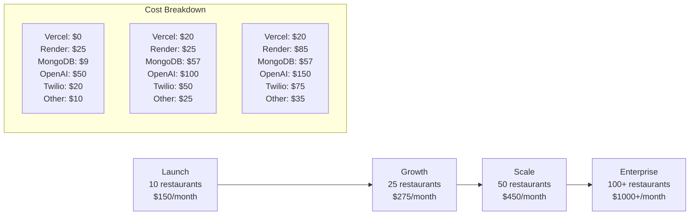

# Production Deployment Cost Analysis & Roadmap
## Final-MVP Restaurant Marketing Platform

**Target Scale**: 10-50 restaurants, 1,000-5,000 end users  
**Budget**: $200-500/month startup budget  
**Architecture**: React frontend + FastAPI backend + MongoDB + AI services  
**Deployment Strategy**: Vercel (frontend) + Render (backend)

---

## 📊 Executive Summary

### Monthly Cost Breakdown (Optimized for Startup Budget)

| Service Category | Provider | Monthly Cost | Scaling Cost |
|-----------------|----------|-------------|--------------|
| **Frontend Hosting** | Vercel Pro | $0-20 | Linear with traffic |
| **Backend Hosting** | Render | $25-50 | $7-25 per service |
| **Database** | MongoDB Atlas | $9-57 | Tiered scaling |
| **AI Services** | OpenAI API | $50-150 | Usage-based |
| **SMS Services** | Twilio | $20-75 | Per message |
| **CDN & Storage** | Cloudflare | $5-15 | Bandwidth-based |
| **Domain & SSL** | Namecheap + Let's Encrypt | $2-5 | Annual |
| **Monitoring** | Render + Vercel built-in | $0-25 | Feature-based |
| **Total** | **Multiple** | **$111-397** | **Scales with usage** |

### 🎯 **Key Finding**: Your platform can launch for ~$150/month and scale to $450/month within budget!

---

## 💰 Detailed Cost Analysis

### 1. Frontend Hosting - Vercel

#### **Recommended Plan: Vercel Pro ($20/month)**

| Tier | Cost | Bandwidth | Build Minutes | Team Members | Best For |
|------|------|-----------|---------------|--------------|----------|
| **Hobby** | $0 | 100GB | 6,000 min | 1 | MVP testing |
| **Pro** | $20 | 1TB | 24,000 min | 10 | Production launch |
| **Team** | $40 | 1TB | 24,000 min | Unlimited | Growth phase |

**Cost Projections:**
- **10 restaurants**: Hobby tier ($0) sufficient
- **25 restaurants**: Pro tier ($20) recommended  
- **50 restaurants**: Pro tier ($20) still sufficient

#### **Vercel Advantages for Your Stack:**
- ✅ **React optimization**: Built for React/Next.js
- ✅ **Global CDN**: 100+ edge locations
- ✅ **Automatic SSL**: Free certificates
- ✅ **Preview deployments**: Perfect for testing
- ✅ **Environment variables**: Secure config management

### 2. Backend Hosting - Render

#### **Recommended Plan: Render Web Service ($25/month)**

| Tier | Cost | RAM | CPU | Storage | Bandwidth | Best For |
|------|------|-----|-----|---------|-----------|----------|
| **Starter** | $7 | 512MB | 0.1 CPU | 1GB SSD | 100GB | Development |
| **Standard** | $25 | 2GB | 1 CPU | 10GB SSD | 500GB | Production |
| **Pro** | $85 | 8GB | 2 CPU | 50GB SSD | 1TB | High traffic |

**Cost Projections:**
- **10 restaurants**: Standard ($25) sufficient
- **25 restaurants**: Standard ($25) with monitoring
- **50 restaurants**: Consider Pro ($85) or horizontal scaling

#### **Render Advantages for FastAPI:**
- ✅ **Python native**: Excellent FastAPI support
- ✅ **Auto-deploy**: Git-based deployments
- ✅ **Health checks**: Built-in monitoring
- ✅ **Environment management**: Secure secrets
- ✅ **Horizontal scaling**: Easy to add services

### 3. Database - MongoDB Atlas

#### **Recommended Plan: M10 Dedicated ($9/month)**

| Tier | Cost | RAM | Storage | IOPS | Connections | Best For |
|------|------|-----|---------|------|-------------|----------|
| **M0 Free** | $0 | 512MB | 512MB | 100 | 500 | Development |
| **M2 Shared** | $9 | 2GB | 2GB | 100 | 500 | Small production |
| **M10 Dedicated** | $57 | 2GB | 10GB | 3000 | 1500 | Production |
| **M20 Dedicated** | $134 | 4GB | 20GB | 3000 | 1500 | High performance |

**Cost Projections:**
- **10 restaurants**: M2 Shared ($9) sufficient
- **25 restaurants**: M10 Dedicated ($57) recommended
- **50 restaurants**: M10 Dedicated ($57) with optimization

#### **MongoDB Atlas Benefits:**
- ✅ **Managed service**: No maintenance overhead
- ✅ **Automatic backups**: Point-in-time recovery
- ✅ **Global clusters**: Multi-region support
- ✅ **Built-in security**: Encryption at rest/transit
- ✅ **Performance insights**: Query optimization

### 4. AI Services - OpenAI API

#### **Usage-Based Pricing (Pay-per-token)**

| Model | Input Cost | Output Cost | Use Case | Monthly Estimate |
|-------|------------|-------------|----------|------------------|
| **GPT-3.5-turbo** | $0.50/1M tokens | $1.50/1M tokens | Content generation | $30-80 |
| **GPT-4** | $10.00/1M tokens | $30.00/1M tokens | Complex analysis | $50-150 |
| **GPT-4-turbo** | $5.00/1M tokens | $15.00/1M tokens | Website generation | $40-120 |

**Usage Estimates (Based on Your Features):**
- **Digital Grader**: ~50K tokens per analysis = $2.50 per restaurant
- **Website Builder**: ~200K tokens per site = $10 per website
- **Content Generation**: ~30K tokens per campaign = $1.50 per campaign
- **Menu Optimization**: ~40K tokens per analysis = $2 per restaurant

**Cost Projections:**
- **10 restaurants**: $50-80/month (moderate AI usage)
- **25 restaurants**: $100-150/month (regular AI features)
- **50 restaurants**: $150-250/month (heavy AI usage)

#### **Cost Optimization Strategies:**
- ✅ **Use GPT-3.5-turbo** for simple tasks (5x cheaper)
- ✅ **Implement caching** for repeated queries
- ✅ **Token limits** per user/restaurant
- ✅ **Batch processing** for efficiency

### 5. SMS Services - Twilio

#### **Pay-per-Message Pricing**

| Service | Cost | Volume Discounts | Use Case |
|---------|------|------------------|----------|
| **SMS (US)** | $0.0075/message | 10% at 100K+ | Marketing campaigns |
| **Phone Numbers** | $1/month | N/A | Dedicated numbers |
| **Verify API** | $0.05/verification | N/A | Phone verification |

**Usage Estimates:**
- **Average restaurant**: 200 SMS/month
- **Campaign frequency**: 2-4 campaigns/month
- **Customer list size**: 50-200 customers per restaurant

**Cost Projections:**
- **10 restaurants**: $20-40/month (2,000-4,000 SMS)
- **25 restaurants**: $40-75/month (5,000-10,000 SMS)
- **50 restaurants**: $75-150/month (10,000-20,000 SMS)

### 6. CDN & Storage - Cloudflare

#### **Recommended Plan: Cloudflare Pro ($20/month)**

| Tier | Cost | Bandwidth | Features | Best For |
|------|------|-----------|----------|----------|
| **Free** | $0 | Unlimited | Basic CDN, SSL | Development |
| **Pro** | $20 | Unlimited | WAF, Page Rules | Production |
| **Business** | $200 | Unlimited | Advanced security | Enterprise |

**Additional Storage (Cloudflare R2):**
- **$0.015/GB/month** for storage
- **$0.36/million** requests
- **Free egress** (major cost savings vs AWS S3)

**Cost Projections:**
- **Image storage**: ~10GB = $0.15/month
- **Website assets**: ~5GB = $0.08/month
- **Total**: $5-15/month including CDN

### 7. Domain & SSL

#### **Annual Costs (Amortized Monthly)**

| Service | Provider | Annual Cost | Monthly Cost |
|---------|----------|-------------|--------------|
| **Domain (.com)** | Namecheap | $12-15 | $1-1.25 |
| **SSL Certificate** | Let's Encrypt | Free | $0 |
| **Email forwarding** | Cloudflare | $5/month | $5 |

**Total**: $2-6/month

### 8. Monitoring & Analytics

#### **Built-in vs. Third-party Options**

| Service | Cost | Features | Integration |
|---------|------|----------|-------------|
| **Render Metrics** | Free | Basic monitoring | Built-in |
| **Vercel Analytics** | Free | Performance insights | Built-in |
| **Sentry (Error tracking)** | $0-26/month | Error monitoring | Easy setup |
| **LogRocket** | $0-99/month | Session replay | Advanced debugging |

**Recommended**: Start with free built-in tools, add Sentry ($26/month) for production

---

## 📈 Scaling Cost Projections

### Growth Scenarios



### Cost Per Restaurant Analysis

| Scale | Total Cost | Cost/Restaurant | Revenue/Restaurant | Profit Margin |
|-------|------------|-----------------|-------------------|---------------|
| **10 restaurants** | $150/month | $15/restaurant | $50-100 | 70-85% |
| **25 restaurants** | $275/month | $11/restaurant | $50-100 | 78-89% |
| **50 restaurants** | $450/month | $9/restaurant | $50-100 | 82-91% |

**Key Insight**: Cost per restaurant decreases with scale, improving unit economics!

---

## 🚀 Production Deployment Roadmap

### Phase 1: Immediate Deployment (Week 1-2)

#### **Week 1: Infrastructure Setup**

**Day 1-2: Database Setup**
```bash
# MongoDB Atlas Setup
1. Create MongoDB Atlas account
2. Create M2 cluster ($9/month)
3. Configure IP whitelist
4. Create database user
5. Get connection string
```

**Day 3-4: Backend Deployment (Render)**
```bash
# Render Setup
1. Connect GitHub repository
2. Create Web Service
3. Configure environment variables:
   - MONGODB_URL
   - OPENAI_API_KEY
   - TWILIO_ACCOUNT_SID
   - TWILIO_AUTH_TOKEN
   - JWT_SECRET
4. Set build command: pip install -r requirements.txt
5. Set start command: uvicorn app.main:app --host 0.0.0.0 --port $PORT
```

**Day 5-7: Frontend Deployment (Vercel)**
```bash
# Vercel Setup
1. Connect GitHub repository
2. Configure build settings:
   - Framework: React
   - Build command: npm run build
   - Output directory: build
3. Set environment variables:
   - REACT_APP_API_URL=https://your-render-app.onrender.com
4. Configure custom domain
```

#### **Week 2: Service Integration**

**OpenAI API Setup**
```bash
# OpenAI Configuration
1. Create OpenAI account
2. Generate API key
3. Set usage limits ($100/month initially)
4. Configure rate limiting in backend
```

**Twilio SMS Setup**
```bash
# Twilio Configuration
1. Create Twilio account
2. Get phone number ($1/month)
3. Configure webhook URLs
4. Set up SMS templates
```

**Domain & SSL Setup**
```bash
# Domain Configuration
1. Purchase domain (Namecheap)
2. Configure DNS (Cloudflare)
3. Set up SSL (automatic via Vercel/Render)
4. Configure email forwarding
```

### Phase 2: Optimization & Monitoring (Week 3-4)

#### **Week 3: Performance Optimization**

**Backend Optimization**
```python
# Add to requirements.txt
gunicorn==21.2.0
redis==4.5.4

# Update start command in Render
gunicorn app.main:app -w 2 -k uvicorn.workers.UvicornWorker --bind 0.0.0.0:$PORT
```

**Database Optimization**
```javascript
// Add indexes for common queries
db.restaurants.createIndex({ "user_id": 1 })
db.campaigns.createIndex({ "restaurant_id": 1, "created_at": -1 })
db.websites.createIndex({ "restaurant_id": 1 })
```

**Frontend Optimization**
```json
// Add to package.json
{
  "scripts": {
    "build": "GENERATE_SOURCEMAP=false react-scripts build"
  }
}
```

#### **Week 4: Monitoring Setup**

**Error Tracking (Sentry)**
```bash
# Install Sentry
npm install @sentry/react
pip install sentry-sdk[fastapi]
```

**Performance Monitoring**
```python
# Add to FastAPI app
from sentry_sdk.integrations.fastapi import FastApiIntegration

sentry_sdk.init(
    dsn="YOUR_SENTRY_DSN",
    integrations=[FastApiIntegration()],
    traces_sample_rate=0.1,
)
```

**Cost Monitoring**
```bash
# Set up billing alerts
1. OpenAI: $50, $100, $150 thresholds
2. Twilio: $25, $50, $75 thresholds
3. MongoDB: Usage alerts at 80%
4. Render: Resource usage monitoring
```

### Phase 3: Scaling Preparation (Month 2)

#### **Auto-scaling Configuration**

**Render Horizontal Scaling**
```yaml
# render.yaml
services:
  - type: web
    name: final-mvp-backend
    env: python
    plan: standard
    buildCommand: pip install -r requirements.txt
    startCommand: gunicorn app.main:app -w 2 -k uvicorn.workers.UvicornWorker --bind 0.0.0.0:$PORT
    envVars:
      - key: MONGODB_URL
        sync: false
      - key: OPENAI_API_KEY
        sync: false
    scaling:
      minInstances: 1
      maxInstances: 3
```

**Database Scaling Strategy**
```bash
# MongoDB Atlas scaling plan
1. Monitor connection usage
2. Upgrade to M10 at 80% capacity
3. Enable auto-scaling for storage
4. Set up read replicas if needed
```

#### **Cost Optimization Automation**

**AI Usage Optimization**
```python
# Add to OpenAI service
class CostOptimizedOpenAI:
    def __init__(self):
        self.daily_limit = 1000  # tokens per restaurant per day
        self.cache = {}  # Simple in-memory cache
    
    async def generate_with_limits(self, prompt, restaurant_id):
        # Check daily usage
        usage = await self.get_daily_usage(restaurant_id)
        if usage > self.daily_limit:
            return self.get_cached_response(prompt)
        
        # Check cache first
        cache_key = hashlib.md5(prompt.encode()).hexdigest()
        if cache_key in self.cache:
            return self.cache[cache_key]
        
        # Generate and cache
        response = await self.openai_client.generate(prompt)
        self.cache[cache_key] = response
        return response
```

---

## 🛡️ Security & Compliance

### Security Hardening Checklist

#### **Environment Security**
- [ ] **Environment variables**: All secrets in environment variables
- [ ] **API key rotation**: Monthly rotation schedule
- [ ] **Database security**: IP whitelist + authentication
- [ ] **HTTPS enforcement**: All traffic encrypted
- [ ] **CORS configuration**: Restrict origins to your domains

#### **Application Security**
```python
# Add security middleware
from fastapi.middleware.cors import CORSMiddleware
from fastapi.middleware.trustedhost import TrustedHostMiddleware

app.add_middleware(
    TrustedHostMiddleware, 
    allowed_hosts=["yourdomain.com", "*.yourdomain.com"]
)

app.add_middleware(
    CORSMiddleware,
    allow_origins=["https://yourdomain.com"],
    allow_credentials=True,
    allow_methods=["GET", "POST", "PUT", "DELETE"],
    allow_headers=["*"],
)
```

#### **Data Protection**
- [ ] **Data encryption**: At rest and in transit
- [ ] **User data anonymization**: PII protection
- [ ] **Backup encryption**: Encrypted backups
- [ ] **Access logging**: Audit trail for data access

### Compliance Considerations

#### **GDPR/Privacy**
- [ ] **Privacy policy**: Clear data usage terms
- [ ] **Data retention**: Automated cleanup policies
- [ ] **User consent**: Explicit opt-ins for marketing
- [ ] **Data export**: User data download capability

#### **Restaurant Industry**
- [ ] **PCI compliance**: If handling payments
- [ ] **Health data**: If storing health-related info
- [ ] **Local regulations**: State/local business requirements

---

## 📊 Performance Monitoring & Analytics

### Key Performance Indicators (KPIs)

#### **Technical KPIs**
| Metric | Target | Monitoring Tool | Alert Threshold |
|--------|--------|-----------------|-----------------|
| **Response Time** | <500ms | Render metrics | >1000ms |
| **Uptime** | >99.5% | Vercel/Render | <99% |
| **Error Rate** | <1% | Sentry | >2% |
| **Database Performance** | <100ms | MongoDB Atlas | >500ms |

#### **Business KPIs**
| Metric | Target | Tracking Method | Review Frequency |
|--------|--------|-----------------|------------------|
| **Cost per Restaurant** | <$15 | Manual calculation | Weekly |
| **AI Usage Efficiency** | >80% cache hit | Custom metrics | Daily |
| **Customer Satisfaction** | >4.5/5 | User feedback | Monthly |
| **Feature Adoption** | >60% | Analytics | Weekly |

### Monitoring Dashboard Setup

#### **Render Monitoring**
```bash
# Built-in metrics available:
- CPU usage
- Memory usage
- Response times
- Error rates
- Request volume
```

#### **Custom Metrics Collection**
```python
# Add to FastAPI app
import time
from prometheus_client import Counter, Histogram, generate_latest

REQUEST_COUNT = Counter('requests_total', 'Total requests', ['method', 'endpoint'])
REQUEST_LATENCY = Histogram('request_duration_seconds', 'Request latency')

@app.middleware("http")
async def add_process_time_header(request: Request, call_next):
    start_time = time.time()
    response = await call_next(request)
    process_time = time.time() - start_time
    
    REQUEST_COUNT.labels(method=request.method, endpoint=request.url.path).inc()
    REQUEST_LATENCY.observe(process_time)
    
    return response

@app.get("/metrics")
async def metrics():
    return Response(generate_latest(), media_type="text/plain")
```

---

## 💡 Cost Optimization Strategies

### Immediate Cost Savings

#### **1. AI Usage Optimization**
```python
# Implement intelligent caching
class SmartCache:
    def __init__(self):
        self.cache = {}
        self.ttl = 3600  # 1 hour
    
    def get_cache_key(self, prompt, restaurant_type):
        # Create semantic cache key
        return f"{restaurant_type}:{hashlib.md5(prompt.encode()).hexdigest()}"
    
    async def get_or_generate(self, prompt, restaurant_data):
        cache_key = self.get_cache_key(prompt, restaurant_data.get('cuisine_type'))
        
        if cache_key in self.cache:
            return self.cache[cache_key]
        
        # Generate new content
        result = await openai_service.generate(prompt)
        self.cache[cache_key] = result
        return result
```

**Potential Savings**: 40-60% reduction in OpenAI costs

#### **2. Database Query Optimization**
```python
# Optimize common queries
class OptimizedQueries:
    @staticmethod
    async def get_restaurant_dashboard(restaurant_id):
        # Single aggregation query instead of multiple
        pipeline = [
            {"$match": {"restaurant_id": restaurant_id}},
            {"$lookup": {
                "from": "campaigns",
                "localField": "restaurant_id",
                "foreignField": "restaurant_id",
                "as": "campaigns"
            }},
            {"$lookup": {
                "from": "websites",
                "localField": "restaurant_id", 
                "foreignField": "restaurant_id",
                "as": "websites"
            }}
        ]
        return await db.restaurants.aggregate(pipeline).to_list(1)
```

**Potential Savings**: 30-50% reduction in database costs

#### **3. CDN Optimization**
```javascript
// Optimize asset delivery
const optimizeAssets = {
    // Compress images
    images: {
        format: 'webp',
        quality: 80,
        progressive: true
    },
    
    // Bundle optimization
    webpack: {
        splitChunks: {
            chunks: 'all',
            cacheGroups: {
                vendor: {
                    test: /[\\/]node_modules[\\/]/,
                    name: 'vendors',
                    chunks: 'all',
                }
            }
        }
    }
}
```

**Potential Savings**: 20-30% reduction in bandwidth costs

### Long-term Cost Management

#### **1. Usage-Based Pricing Tiers**
```python
# Implement usage tiers for restaurants
class UsageTiers:
    TIERS = {
        'basic': {
            'ai_requests': 100,
            'sms_messages': 500,
            'websites': 1,
            'price': 49
        },
        'professional': {
            'ai_requests': 500,
            'sms_messages': 2000,
            'websites': 3,
            'price': 99
        },
        'enterprise': {
            'ai_requests': 2000,
            'sms_messages': 10000,
            'websites': 10,
            'price': 199
        }
    }
```

#### **2. Predictive Cost Scaling**
```python
# Predict and prevent cost overruns
class CostPredictor:
    def __init__(self):
        self.usage_history = []
    
    def predict_monthly_cost(self, current_usage):
        # Simple linear prediction
        days_in_month = 30
        days_elapsed = datetime.now().day
        
        projected_usage = (current_usage / days_elapsed) * days_in_month
        return self.calculate_cost(projected_usage)
    
    def should_alert(self, predicted_cost, budget):
        return predicted_cost > budget * 0.8  # Alert at 80% of budget
```

---

## 🔄 Backup & Disaster Recovery

### Backup Strategy

#### **Database Backups**
```bash
# MongoDB Atlas automatic backups
- Point-in-time recovery (last 24 hours)
- Daily snapshots (retained for 7 days)
- Weekly snapshots (retained for 4 weeks)
- Monthly snapshots (retained for 12 months)
```

#### **Application Backups**
```bash
# Git-based backup strategy
1. All code in GitHub (primary backup)
2. Environment variables documented
3. Database schema versioned
4. Configuration files in repository
```

#### **Data Export Procedures**
```python
# Automated data export
import asyncio
from datetime import datetime

async def backup_critical_data():
    backup_date = datetime.now().strftime("%Y%m%d")
    
    # Export restaurants
    restaurants = await db.restaurants.find({}).to_list(None)
    with open(f"backup_restaurants_{backup_date}.json", "w") as f:
        json.dump(restaurants, f, default=str)
    
    # Export campaigns
    campaigns = await db.campaigns.find({}).to_list(None)
    with open(f"backup_campaigns_{backup_date}.json", "w") as f:
        json.dump(campaigns, f, default=str)
    
    # Upload to cloud storage
    await upload_to_cloudflare_r2(f"backup_restaurants_{backup_date}.json")
    await upload_to_cloudflare_r2(f"backup_campaigns_{backup_date}.json")
```

### Disaster Recovery Plan

#### **Recovery Time Objectives (RTO)**
- **Database**: 15 minutes (MongoDB Atlas automatic failover)
- **Backend**: 10 minutes (Render redeploy)
- **Frontend**: 5 minutes (Vercel automatic failover)
- **Total System**: 30 minutes maximum

#### **Recovery Point Objectives (RPO)**
- **Database**: 1 hour (point-in-time recovery)
- **Application**: 0 minutes (Git-based deployment)
- **Configuration**: 0 minutes (environment variables backed up)

#### **Disaster Recovery Procedures**
```bash
# Emergency recovery checklist
1. Assess scope of outage
2. Check service status pages (Render, Vercel, MongoDB)
3. Verify DNS resolution
4. Check application logs
5. Restore from backup if needed
6. Communicate with users
7. Post-mortem analysis
```

---

## 📋 Production Launch Checklist

### Pre-Launch Checklist (Complete before going live)

#### **Infrastructure**
- [ ] **Domain purchased** and DNS configured
- [ ] **SSL certificates** installed and working
- [ ] **CDN configured** with proper caching rules
- [ ] **Database** production cluster running
- [ ] **Backup systems** tested and verified
- [ ] **Monitoring** alerts configured

#### **Application**
- [ ] **Environment variables** set in production
- [ ] **API keys** configured with proper limits
- [ ] **Error tracking** (Sentry) installed
- [ ] **Performance monitoring** enabled
- [ ] **Security headers** configured
- [ ] **CORS policies** properly set

#### **Testing**
- [ ] **Load testing** completed
- [ ] **Security scanning** performed
- [ ] **End-to-end testing** passed
- [ ] **Mobile responsiveness** verified
- [ ] **Cross-browser compatibility** tested
- [ ] **API endpoints** all functional

#### **Documentation**
- [ ] **API documentation** updated
- [ ] **Deployment procedures** documented
- [ ] **Troubleshooting guide** created
- [ ] **User documentation** complete
- [ ] **Admin procedures** documented

#### **Legal & Compliance**
- [ ] **Privacy policy** published
- [ ] **Terms of service** updated
- [ ] **GDPR compliance** verified
- [ ] **Data retention policies** implemented
- [ ] **User consent flows** tested

### Launch Day Procedures

#### **Go-Live Steps**
```bash
# 1. Final deployment
git tag v1.0.0
git push origin v1.0.0

# 2. Database migration (if needed)
python migrate_to_production.py

# 3. DNS cutover
# Update DNS records to point to production

# 4. Verify all systems
curl -f https://yourdomain.com/api/health
curl -f https://yourdomain.com

# 5. Enable monitoring alerts
# Activate all production alerts

# 6. Announce launch
# Notify stakeholders and users
```

#### **Post-Launch Monitoring (First 24 hours)**
- [ ] **Monitor error rates** (target: <1%)
- [ ] **Check response times** (target: <500ms)
- [ ] **Verify user registrations** working
- [ ] **Test payment processing** (if applicable)
- [ ] **Monitor resource usage** (CPU, memory, database)
- [ ] **Check third-party integrations** (OpenAI, Twilio)

---

## 📞 Support & Maintenance

### Ongoing Maintenance Schedule

#### **Daily Tasks**
- [ ] Check error logs and alerts
- [ ] Monitor cost usage vs. budget
- [ ] Verify backup completion
- [ ] Review performance metrics

#### **Weekly Tasks**
- [ ] Security updates and patches
- [ ] Performance optimization review
- [ ] Cost analysis and optimization
- [ ] User feedback review

#### **Monthly Tasks**
- [ ] Dependency updates
- [ ] Security audit
- [ ] Capacity planning review
- [ ] Business metrics analysis

#### **Quarterly Tasks**
- [ ] Infrastructure cost review
- [ ] Technology stack evaluation
- [ ] Disaster recovery testing
- [ ] Compliance audit

### Support Escalation Plan

#### **Issue Severity Levels**
| Severity | Description | Response Time | Resolution Time |
|----------|-------------|---------------|-----------------|
| **Critical** | System down, data loss | 15 minutes | 2 hours |
| **High** | Major feature broken | 1 hour | 8 hours |
| **Medium** | Minor feature issue | 4 hours | 24 hours |
| **Low** | Enhancement request | 24 hours | 1 week |

#### **Contact Information**
```bash
# Emergency contacts
Primary: your-email@domain.com
Secondary: backup-email@domain.com

# Service providers
Render Support: help@render.com
Vercel Support: support@vercel.com
MongoDB Atlas: support@mongodb.com
OpenAI Support: support@openai.com
Twilio Support: help@twilio.com
```

---

## 🎯 Success Metrics & KPIs

### Technical Success Metrics

#### **Performance Targets**
| Metric | Target | Current | Status |
|--------|--------|---------|--------|
| **Page Load Time** | <3 seconds | TBD | 🟡 Monitor |
| **API Response Time** | <500ms | TBD | 🟡 Monitor |
| **Uptime** | >99.5% | TBD | 🟡 Monitor |
| **Error Rate** | <1% | TBD | 🟡 Monitor |

#### **Cost Efficiency Targets**
| Metric | Target | Current | Status |
|--------|--------|---------|--------|
| **Cost per Restaurant** | <$15/month | TBD | 🟡 Monitor |
| **AI Cost per Request** | <$0.10 | TBD | 🟡 Monitor |
| **Infrastructure Efficiency** | >80% utilization | TBD | 🟡 Monitor |

### Business Success Metrics

#### **User Adoption**
- **Restaurant Onboarding**: Target 10 restaurants in first month
- **Feature Usage**: >60% of restaurants using AI features
- **User Satisfaction**: >4.5