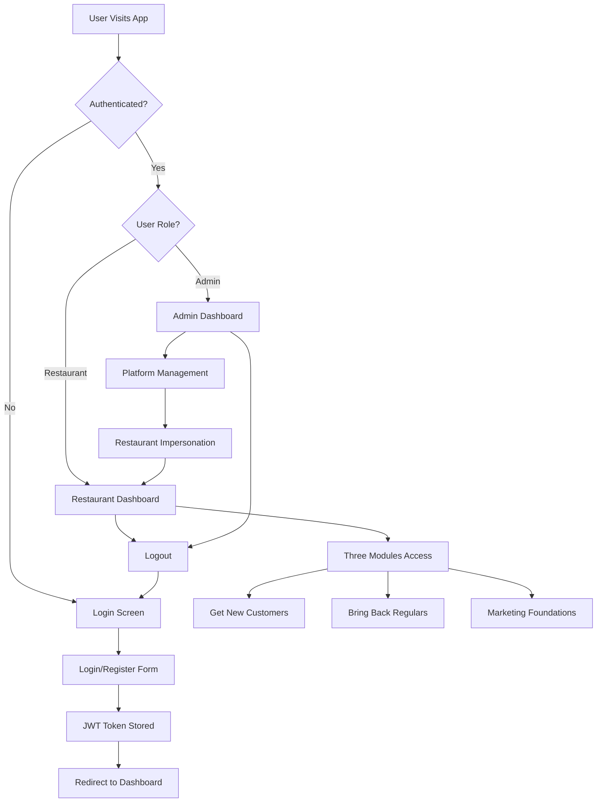

# Restaurant Authentication Implementation Plan

## Current State Analysis

### ✅ **What's Already Built:**
- **Backend Authentication System**: Complete JWT-based auth with login/register endpoints
- **Database Schema**: Users, restaurants, and session tables properly designed
- **AuthContext**: React context with login, register, logout, and impersonation functions
- **Login Component**: Full-featured login/signup form with restaurant registration
- **Middleware**: Authentication, authorization, and restaurant context middleware
- **Dashboard Components**: Both restaurant and admin dashboards exist
- **API Integration**: Complete API service with token management and interceptors

### ❌ **What's Missing/Broken:**
- **Server Route Integration**: Auth and dashboard routes not imported in server/index.js
- **App.js Integration**: No authentication flow - shows modules directly without login
- **Database Initialization**: Database setup not called on server start
- **Protected Routing**: No route protection for authenticated vs unauthenticated users
- **Session Persistence**: AuthContext not properly integrated with App.js

---

## Implementation Architecture



---

## Detailed Implementation Plan

### **Phase 1: Server Infrastructure Fix** 🔧
**Priority: Critical**

#### 1.1 Fix Server Route Integration
- Add missing route imports to `server/index.js`
- Initialize database on server startup
- Add proper error handling for database connection

#### 1.2 Database Initialization
- Ensure database tables are created on startup
- Create default admin user if not exists
- Add database connection health checks

**Files to Modify:**
- `server/index.js` - Add auth and dashboard routes
- `server/models/database.js` - Ensure initialization is called

---

### **Phase 2: Frontend Authentication Flow** 🔐
**Priority: Critical**

#### 2.1 App.js Authentication Integration
- Wrap App.js with `AuthProvider`
- Implement authentication-based routing
- Add loading states for authentication checks
- Handle token expiration and automatic logout

#### 2.2 Protected Route Implementation
- Create `ProtectedRoute` component for authenticated access
- Implement role-based access control (restaurant vs admin)
- Add redirect logic for unauthenticated users

#### 2.3 Main App Structure Redesign
```jsx
// New App.js structure
function App() {
  return (
    <AuthProvider>
      <Router>
        <Routes>
          <Route path="/login" element={<Login />} />
          <Route path="/" element={
            <ProtectedRoute>
              <MainDashboard />
            </ProtectedRoute>
          } />
        </Routes>
      </Router>
    </AuthProvider>
  );
}
```

**Files to Create/Modify:**
- `client/src/App.js` - Complete restructure
- `client/src/index.js` - Add Router wrapper
- `client/src/components/ProtectedRoute.js` - New component
- `client/src/components/MainDashboard.js` - New authenticated dashboard

---

### **Phase 3: Dashboard Integration** 📊
**Priority: High**

#### 3.1 Restaurant Dashboard Enhancement
- Integrate existing `RestaurantDashboard` as main landing page
- Add navigation to three modules from dashboard
- Implement restaurant-specific data loading
- Add logout functionality to navigation

#### 3.2 Module Access Control
- Modify `GetNewCustomers`, `BringBackRegulars`, `MarketingFoundations`
- Add restaurant context to all API calls
- Ensure data isolation between restaurants
- Add restaurant name/branding to module headers

#### 3.3 Navigation Enhancement
- Update `Navigation` component
- Add user profile dropdown with logout
- Show current restaurant name
- Add breadcrumb navigation

**Files to Modify:**
- `client/src/components/RestaurantDashboard.js` - Enhanced integration
- `client/src/components/Navigation.js` - Add auth features
- All module components - Add restaurant context

---

### **Phase 4: Session Management** 🔄
**Priority: High**

#### 4.1 Token Refresh Implementation
- Add automatic token refresh before expiration
- Implement refresh token mechanism (optional enhancement)
- Handle concurrent request token refresh

#### 4.2 Session Persistence
- Maintain login state across browser refreshes
- Add "Remember Me" functionality
- Implement secure token storage

#### 4.3 Logout Flow
- Clear all stored tokens and user data
- Redirect to login page
- Add logout confirmation dialog

**Files to Modify:**
- `client/src/contexts/AuthContext.js` - Enhanced session management
- `client/src/services/api.js` - Token refresh logic

---

### **Phase 5: User Experience Enhancements** ✨
**Priority: Medium**

#### 5.1 Profile Management
- Add restaurant profile editing
- Allow password changes
- Restaurant information updates

#### 5.2 Onboarding Flow
- Welcome screen for new restaurants
- Guided tour of features
- Initial setup checklist

#### 5.3 Error Handling & Feedback
- Better error messages for auth failures
- Loading states for all auth operations
- Success notifications for profile updates

**New Files to Create:**
- `client/src/components/ProfileSettings.js`
- `client/src/components/OnboardingWizard.js`
- `client/src/components/LoadingSpinner.js`

---

## Database Schema Requirements

### **Current Schema Status: ✅ Complete**
The existing database schema already supports all authentication requirements:

```sql
-- Users table (✅ Exists)
users (user_id, email, password_hash, role, created_at)

-- Restaurants table (✅ Exists) 
restaurants (restaurant_id, user_id, name, address, phone, created_at)

-- Sessions table (✅ Exists)
sessions (session_id, user_id, impersonating_restaurant_id, created_at, expires_at)
```

**No database changes required** - the schema is already properly designed for restaurant authentication.

---

## API Authentication Flow

### **Current Flow Status: ✅ Implemented**
The authentication flow is already properly implemented:

1. **Registration**: `POST /api/auth/register` - Creates user + restaurant
2. **Login**: `POST /api/auth/login` - Returns JWT token
3. **Token Verification**: `GET /api/auth/me` - Validates current user
4. **Protected Endpoints**: All use `authenticateToken` middleware
5. **Restaurant Context**: `getRestaurantContext` provides restaurant ID

**No API changes required** - the authentication flow is complete and secure.

---

## Implementation Roadmap

### **Week 1: Core Infrastructure** 
- [ ] Fix server route integration
- [ ] Implement App.js authentication flow
- [ ] Create ProtectedRoute component
- [ ] Test basic login/logout functionality

### **Week 2: Dashboard Integration**
- [ ] Integrate RestaurantDashboard as main page
- [ ] Add restaurant context to all modules
- [ ] Implement navigation with logout
- [ ] Test restaurant-specific data isolation

### **Week 3: Session & UX**
- [ ] Implement session persistence
- [ ] Add profile management
- [ ] Create onboarding flow
- [ ] Add comprehensive error handling

### **Week 4: Testing & Polish**
- [ ] End-to-end authentication testing
- [ ] Cross-browser session testing
- [ ] Security audit of token handling
- [ ] Performance optimization

---

## Security Considerations

### **Current Security Status: ✅ Strong**
- JWT tokens with 24-hour expiration
- Bcrypt password hashing (10 rounds)
- Role-based access control
- SQL injection protection with parameterized queries
- CORS configuration for API protection

### **Additional Recommendations:**
- Add rate limiting for login attempts
- Implement password strength requirements
- Add email verification for new accounts
- Consider adding 2FA for admin accounts

---

## Testing Strategy

### **Authentication Testing**
- [ ] Login with valid credentials
- [ ] Login with invalid credentials  
- [ ] Registration flow with restaurant creation
- [ ] Token expiration handling
- [ ] Session persistence across refreshes
- [ ] Logout functionality

### **Authorization Testing**
- [ ] Restaurant access to own data only
- [ ] Admin impersonation functionality
- [ ] Protected route access control
- [ ] API endpoint authorization

### **Integration Testing**
- [ ] Module access with restaurant context
- [ ] Dashboard data loading
- [ ] Navigation between authenticated pages
- [ ] Error handling for network issues

---

## Key Implementation Files

### **Critical Server Files:**
- `server/index.js` - Add missing route imports
- `server/routes/auth.js` - Authentication endpoints (✅ Complete)
- `server/routes/dashboard.js` - Dashboard data endpoints (✅ Complete)
- `server/middleware/auth.js` - Authentication middleware (✅ Complete)
- `server/models/database.js` - Database initialization

### **Critical Client Files:**
- `client/src/App.js` - Main application with auth routing
- `client/src/index.js` - Add Router wrapper
- `client/src/contexts/AuthContext.js` - Authentication context (✅ Complete)
- `client/src/components/Login.js` - Login/register form (✅ Complete)
- `client/src/components/ProtectedRoute.js` - Route protection (New)
- `client/src/components/MainDashboard.js` - Authenticated main view (New)

---

## Success Criteria

### **Phase 1 Success:**
- ✅ Server starts without errors
- ✅ Authentication endpoints accessible
- ✅ Database properly initialized
- ✅ Login/register functionality working

### **Phase 2 Success:**
- ✅ Users see login screen on first visit
- ✅ Successful login redirects to dashboard
- ✅ Token persistence across browser refresh
- ✅ Automatic logout on token expiration

### **Phase 3 Success:**
- ✅ Restaurant dashboard shows personalized data
- ✅ All three modules accessible from dashboard
- ✅ Restaurant-specific data isolation working
- ✅ Logout functionality properly clears session

### **Final Success:**
- ✅ Complete authentication flow working end-to-end
- ✅ Restaurant-specific data in all modules
- ✅ Session persistence and security
- ✅ Clean user experience with proper error handling

---

This plan leverages the existing robust authentication infrastructure while addressing the missing integration points. The implementation focuses on connecting the well-built backend with the frontend components to create a seamless restaurant authentication experience.